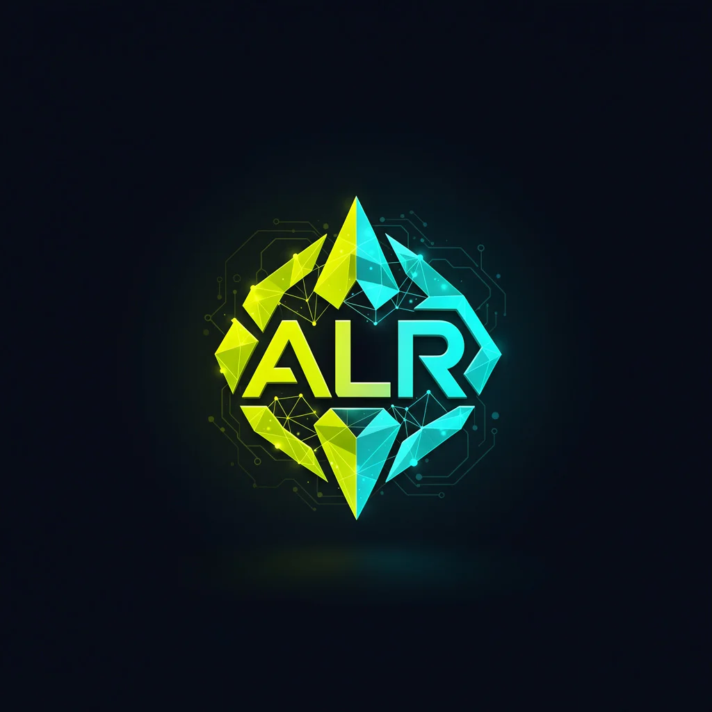
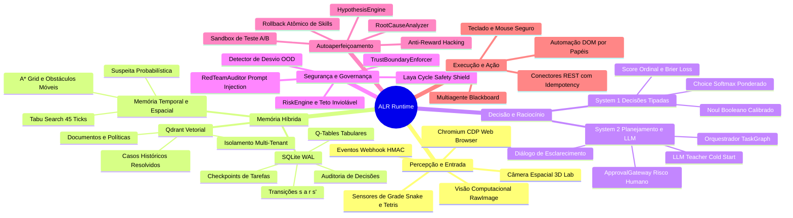
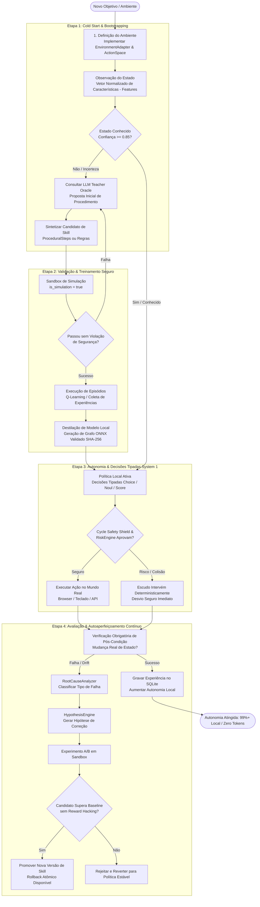
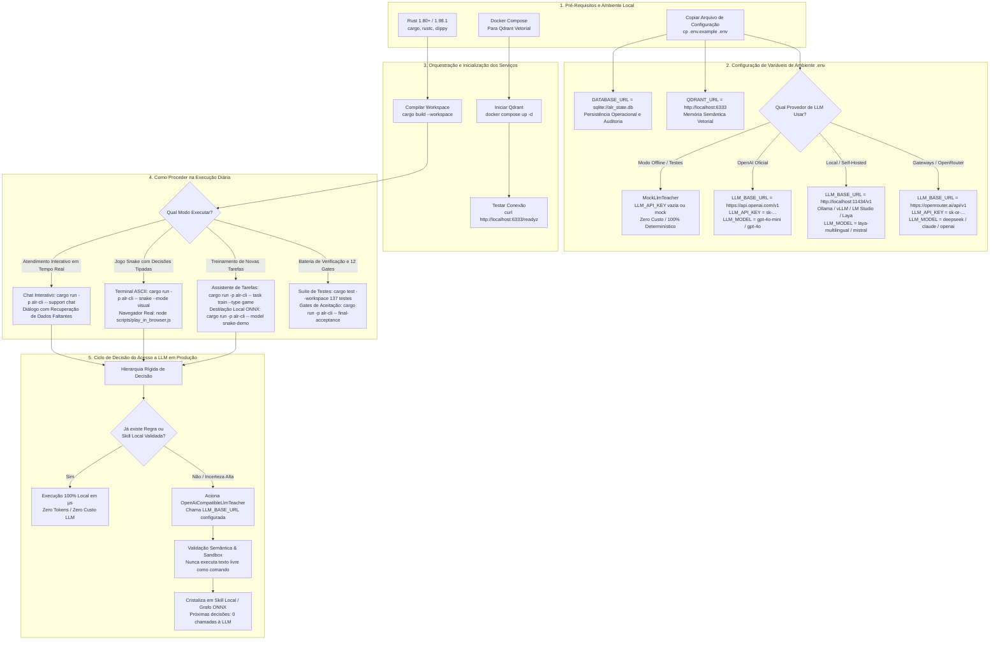
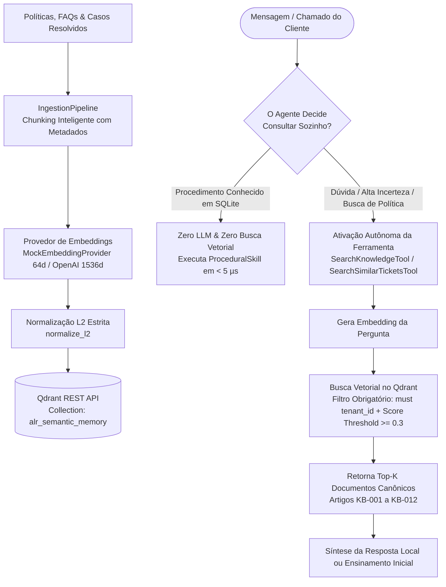
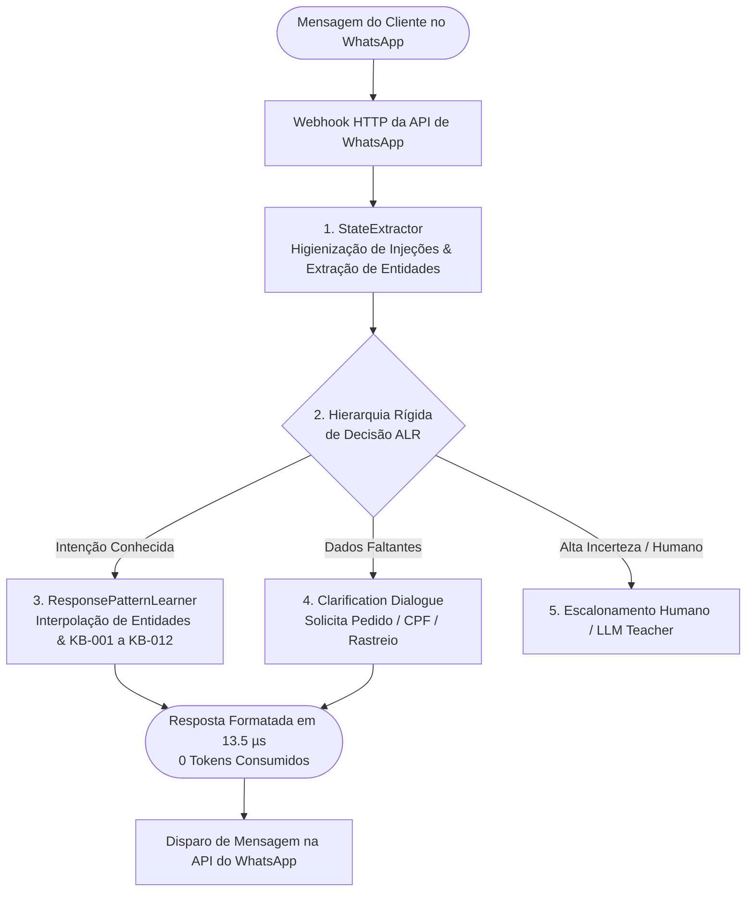
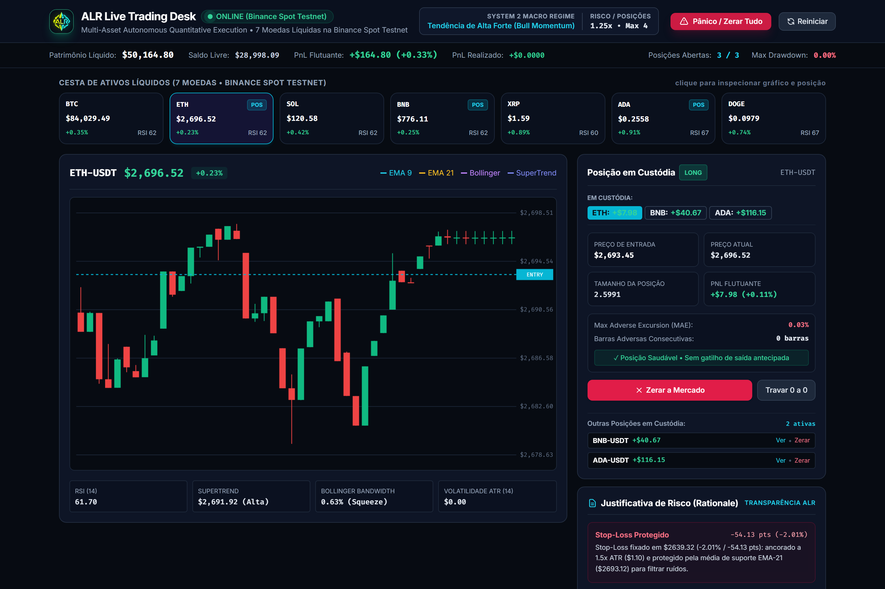
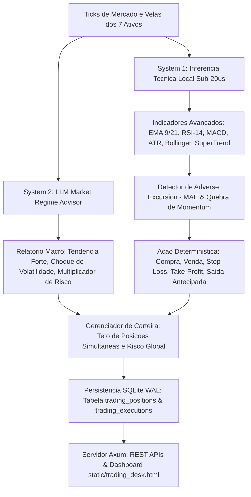

<div align="center">
  
  <h1>Autonomous Learning Runtime (ALR)</h1>
</div>

[](https://www.rust-lang.org)
[](LICENSE)
[]()
[]()
[](docs/training-new-tasks.md)
[](docs/final-certification-report.md)
[](docs/evidence-matrix.md)
[](docs/final-acceptance-report.md)
[](docs/game-engine.md)
[](https://qdrant.tech)

> **"A LLM pode ensinar o agente, mas não precisa controlar permanentemente o agente."**  
> *Um runtime local-first para aprendizado autônomo, memória, planejamento, execução de ferramentas, verificação, recuperação e reuso de habilidades em jogos, navegadores, mundos simulados e ambientes externos.*

O **Autonomous Learning Runtime (ALR)** é um runtime de agentes autônomos construído do zero em **Rust**. Ele demonstra como um núcleo cognitivo único aprende, valida, cristaliza, transfere, autoaperfeiçoa e coordena competências locais em múltiplos domínios:
1. **Controle Dinâmico Discreto (Snake)**
2. **Atendimento ao Cliente & Memória Semântica (Customer Support + Qdrant)**
3. **Automação Web Real (Browser Automation via Chromium CDP)**
4. **Sistemas Externos & Governança (Connectors REST, Webhooks, HMAC & Approval Gateway)**
5. **Modelos Especializados Locais & Destilação (ONNX Real, Model Registry & OOD Abstention)**
6. **Autonomia Corpórea 3D (3D Lab, Hierarchical Planning, A* & Spatial Memory)**
7. **Transferência Universal de Capacidades (Abstração de Ambiente, Generalização Zero-Shot e Few-Shot)**
8. **Autoaperfeiçoamento Autônomo & Auto-Cura (Análise de Falhas, Hipóteses, Sandbox A/B Controlado, Proteção Anti-Reward Hacking & Rollback Atômico)**
9. **Coordenação Multiagente Especializada (Grafo de Tarefas, Meta-Planejador, Quadro Negro, Consenso & Habilidades de Equipe)**
10. **Motor de Autonomia em Jogos (Tetris, Laboratório de Dedução Social, Memória Temporal, Modelo de Suspeita & Adaptadores Externos)**
11. **Validação Adversarial & Certificação Final (12 Gates Formais de Aceitação)**
12. **Treinamento e Execução Autônoma do Chrome Dino Runner (Modo Offline & Visão Computacional no Navegador)**
13. **Automação Omnichannel & WhatsApp em 20 Nichos de Mercado (100% Local, Custo Zero de Tokens & Auto-Aprendizado Dinâmico)**
14. **Aceleração por Hardware SIMD, Sandboxing WASM e Cockpit Web Unificado (Latência < 1 µs e Segurança Formal)**
15. **Controle Nativo de Desktop OS & Adaptação a Novos Jogos (FFI de Teclado e Mouse para Windows/SO, Pong & Adaptador de Ambiente)**
16. **Parada Segura, Botão de Emergência & Abstenção por Novidade (ScreenErrorDetector, GlobalEmergencyStop & OOD)**
17. **Novos Gêneros de Jogos Autônomos (Cartas/Blackjack, Bomberman, FPS 3D & Worms Balístico)**
18. **Benchmark Real de Velocidade (ALR System 1 a 4.0 µs vs Cloud VLMs a 1.5s — 413.203x Speedup)**
19. **Supervisão Autônoma & Auto-QA (Leitura de Backlog, Despacho para Agentes, Execução de Testes e Feedback Loop)**
20. **Automações de Negócio & E-Commerce (Categorização de Produtos, Atributos de Imagens em CPU e Triagem de E-mails)**
21. **Análise Multidimensional de Sentimentos & Roteamento Emocional (Raiva, Dúvidas, Urgência e Churn em < 10 µs)**
22. **Vigilância por Câmera & Notificações Desktop (CCTV em CPU < 1 ms, Tripwire e Alertas do Windows)**
23. **Memória Vetorial Avançada no Qdrant (Embeddings 384d/1536d, BM25 Esparso, Quantização int8 e Busca Híbrida RRF)**
24. **Suíte JEV de Marketing Ops, SEO e Otimização de Anúncios (9 Tarefas Nativas em Rust, $0.00 e Latência em Microssegundos)**
25. **Trading Quantitativo, Robô de Criptomoedas e Bolsa (CryptoTraderEngine, Indicadores Locais, Stop-Loss Inviolável, Simulação de Exchanges e Trailing Stop)**
26. **Conector Oficial Bybit Testnet V5 (Assinatura HMAC-SHA256, Order Book, Saldo Virtual e Despacho de Ordens)**
27. **Conector Oficial Binance Spot Testnet (Assinatura HMAC-SHA256, Ticker/Book, Saldo Virtual, Klines e Despacho de Ordens)**

## ⚡ Quickstart em 3 Minutos: Do Zero ao Agente Operacional

Quer ver o runtime funcionando na sua máquina agora mesmo? Em 3 passos simples você instala, configura e coloca seu primeiro agente em execução autônoma com **0 tokens consumidos e latência de microssegundos**:

```bash
# 1. Clonar o repositório
git clone https://github.com/dilneiss/alr.git
cd alr

# 2. Executar o Quickstart Automatizado (Instala -> Configura -> Treina -> Executa)
cargo run -p alr-cli -- quickstart
```

### 📚 Tutoriais Guiados & Interfaces Visuais Interativas

| Recurso | Tipo | Descrição | Como Acessar / Executar |
| :--- | :---: | :--- | :--- |
| [`docs/quickstart-3-minutos.md`](docs/quickstart-3-minutos.md) | 📄 Documento | Tutorial passo a passo de 180s: Instalar $\to$ Configurar $\to$ Treinar | Leitura direta no GitHub / Markdown |
| [`static/install_and_usage.html`](static/install_and_usage.html) | 🖥️ Web Interativa | Guia visual de instalação com seletor de SO (Win/Linux/Mac) e simulador CLI | `cargo run -p alr-cli -- install-guide` |
| [`static/showcase.html`](static/showcase.html) | 🌟 Vitrine Web | Demonstração animada completa: Ciclo cognitivo, 20 nichos, jogos e calculadora de ROI | `cargo run -p alr-cli -- showcase` |
| [`static/whatsapp_support.html`](static/whatsapp_support.html) | 📱 WhatsApp Desk | Central omnichannel nos 20 nichos com chat ao vivo e auto-aprendizado dinâmico | `cargo run -p alr-cli -- whatsapp` |
| [`static/alr_cockpit.html`](static/alr_cockpit.html) | 📊 Cockpit Web | Painel de observabilidade de alta performance: SIMD, WASM sandbox e telemetria | `cargo run -p alr-cli -- cockpit` |
| [`ALR Playground Oficial`](http://localhost:3000) | ⚗️ Web Interativa | Centro Principal de Testes e Decisões Tipadas (100% PT-BR, Linha do Tempo & HUD) | `cargo run -p alr-cli -- playground` |

### ⚗️ Playground Interativo do ALR: O Centro Principal de Testes e Decisões

O **Playground do ALR** é o ambiente oficial para experimentar, validar e auditar todas as decisões do runtime em tempo real. Ele combina a velocidade da inferência local em Rust (sub-milissegundo), custo zero de tokens e a transparência da linha de raciocínio visual:

<div align="center">
  
  <p><em>Figura 1: Playground do ALR em execução com a Linha do Tempo Vertical de Raciocínio (Pipeline de Decisão em Rust), HUD de economia comparativa e barras de probabilidade calibradas.</em></p>
</div>

#### 🌟 Destaques da Tela do Playground:
1. **100% em Português:** Interface inteiramente traduzida com clareza nos formulários, métricas e recomendações de código.
2. **Linha do Tempo Vertical de Raciocínio (Estilo Canva / Figma):** Pipeline conectado contínuo com marcadores circulares numerados (`01. Estado de Entrada`, `02. Analisador Semântico`, `03. Escudo de Risco`, `04. Juiz Calibrado`, `05. Portal de Decisão`) e explicações completas legíveis sem corte.
3. **HUD de Economia e Comparativo de Custos:** Contadores de tokens entrada/saída com comparação transparente: **ALR $0.0000000 (100% Gratuito Local)** vs JEV $0.0000161 (163x mais caro) vs Cloud LLM $0.0025000 (155x vs JEV).
4. **Rubrica Dinâmica com Níveis Customizáveis:** Adição e remoção de níveis (`+ Adicionar Nível`, `×`) com cálculo dinâmico da pontuação esperada.
5. **Catálogo Completo no Dropdown `⚡ Mais Casos (7)`:** Acesso imediato a 10 cenários organizados por áreas (Decisões Centrais, Marketing Ops & SEO, Segurança & Risco, Trading).
6. **Integração Pronta via API cURL:** Modal com comando cURL oficial para automações e microsserviços externos.

```bash
# Iniciar o Playground interativo localmente
cargo run -p alr-cli -- playground --port 3000

# Validar os testes oficiais no terminal
cargo run -p alr-cli -- playground-test
```
---

## 📑 Sumário

1. [O Que é o Projeto?](#-o-que-é-o-projeto)
2. [Por Que o ALR Existe?](#-por-que-o-alr-existe)
3. [Comparativo Técnico: Por Que o ALR é Superior ao JEV e Laya / Laya-CoreML?](#-comparativo-técnico-por-que-o-alr-é-superior-ao-jev-e-laya--laya-coreml)
4. [Mapas Mentais da Arquitetura & Fluxos Operacionais](#-mapas-mentais-da-arquitetura--fluxos-operacionais)
5. [Premissa Central](#-premissa-central)
4. [Princípios Arquiteturais](#-princípios-arquiteturais)
5. [O Que o Sistema Faz?](#-o-que-o-sistema-faz)
6. [Casos de Uso Detalhados (Fases 1 a 26)](#-casos-de-uso-detalhados)
   * [Caso 1: Controle Dinâmico em Jogos (Snake)](#caso-1-controle-dinâmico-em-jogos-snake)
   * [Caso 2: Atendimento com Memória Semântica (Customer Support)](#caso-2-atendimento-com-memória-semântica-customer-support)
   * [Caso 3: Automação Web Real no Navegador (Chromium CDP)](#caso-3-automação-web-real-no-navegador-chromium-cdp)
   * [Caso 4: Operação de Sistemas Externos e Conectores Reais](#caso-4-operação-de-sistemas-externos-e-conectores-reais)
   * [Caso 5: Modelos Especializados Locais & Inferência ONNX](#caso-5-modelos-especializados-locais--inferência-onnx)
   * [Caso 6: Autonomia Corpórea 3D & Planejamento Hierárquico](#caso-6-autonomia-corpórea-3d--planejamento-hierárquico)
   * [Caso 7: Transferência de Capacidades & Generalização](#caso-7-transferência-de-capacidades--generalização)
   * [Caso 8: Autoaperfeiçoamento Autônomo & Auto-Cura](#caso-8-autoaperfeiçoamento-autônomo--auto-cura)
   * [Caso 9: Coordenação Multiagente Especializada](#caso-9-coordenação-multiagente-especializada)
   * [Caso 10: Game Autonomy Engine (Tetris, Social Lab & External)](#caso-10-game-autonomy-engine-tetris-social-lab--external)
   * [Caso 11: Validação Adversarial & Certificação Final](#caso-11-validação-adversarial--certificação-final)
   * [Caso 12: Chrome Dino Runner (Simulador Rust & Visão Computacional no Navegador)](#caso-12-chrome-dino-runner-simulador-rust--visão-computacional-no-navegador)
   * [Caso 13: Automação Omnichannel & WhatsApp em 20 Nichos com Custo Zero de Tokens](#caso-13-automação-omnichannel--whatsapp-em-20-nichos-com-custo-zero-de-tokens)
   * [Caso 14: Aceleração SIMD, Sandboxing WASM e Cockpit Web Unificado](#caso-14-aceleração-simd-sandboxing-wasm-e-cockpit-web-unificado)
   * [Caso 15: Controle Físico do Mouse e Teclado Desktop OS](#caso-15-controle-físico-do-mouse-e-teclado-do-sistema-operacional-desktop-os-ffi)
   * [Caso 16: Novos Gêneros de Jogos Autônomos (Cartas, Bomberman, FPS, Worms & Pong)](#caso-16-novos-gêneros-de-jogos-autônomos-cartas-bomberman-fps-3d-worms--pong)
   * [Caso 17: Parada Segura, Botão Global de Pânico e Abstenção por Novidade (OOD)](#caso-17-parada-segura-botão-global-de-pânico-e-abstenção-por-novidade-ood)
   * [Caso 18: Supervisor Autônomo & Auto-QA (Meta-Orquestração de Agentes)](#caso-18-supervisor-autônomo--auto-qa-meta-orquestração-de-agentes)
   * [Caso 19: Automações de E-Commerce (Categorização e Atributos de Imagem em CPU)](#caso-19-automações-de-e-commerce-categorização-e-atributos-de-imagem-em-cpu)
   * [Caso 20: Triagem e Proteção de E-mails Corporativos](#caso-20-triagem-e-proteção-de-e-mails-corporativos)
   * [Caso 21: Análise Multidimensional de Sentimentos e Roteamento Emocional](#caso-21-análise-multidimensional-de-sentimentos-e-roteamento-emocional)
   * [Caso 22: Vigilância por Câmera de Segurança (CCTV) e Notificações Desktop](#caso-22-vigilância-por-câmera-de-segurança-cctv-e-notificações-desktop)
   * [Caso 23: Memória Semântica Vetorial de Alta Fidelidade no Qdrant](#caso-23-memória-semântica-vetorial-de-alta-fidelidade-no-qdrant)
   * [Caso 24: Suíte de Marketing Ops, SEO e Anúncios de Alta Performance (JEV Suite)](#caso-24-suíte-de-marketing-ops-seo-e-anúncios-de-alta-performance-jev-suite)
   * [Caso 25: Trading Quantitativo, Robô de Criptomoedas e Bolsa (CryptoTraderEngine)](#caso-25-trading-quantitativo-robô-de-criptomoedas-e-bolsa-cryptotraderengine)
   * [Caso 26: Playground Interativo de Decisões Tipadas (TypeSafe JEV-1.13)](#caso-26-playground-interativo-de-decisões-tipadas-typesafe-jev-113)
7. [Detector Universal de Loops & Evasão](#-detector-universal-de-loops--evasão)
8. [Treinamento de Novas Tarefas (Guia & CLI)](#-treinamento-de-novas-tarefas-guia--cli)
9. [Memória Semântica Vetorial no Qdrant: Geração de Embeddings & Recuperação Autônoma](#-memória-semântica-vetorial-no-qdrant-geração-de-embeddings--recuperação-autônoma)
10. [Hierarquia Rígida de Decisão de 8 Níveis](#-hierarquia-rígida-de-decisão-de-8-níveis)
11. [Estrutura Completa do Workspace Cargo (22 Crates)](#-estrutura-completa-do-workspace-cargo-22-crates)
12. [Como Instalar e Pré-Requisitos](#-como-instalar-e-pré-requisitos)
13. [Como Usar e Exemplos de Comandos da CLI](#-como-usar-e-exemplos-de-comandos-da-cli)
14. [Demonstrações Práticas](#-demonstrações-práticas)
15. [Integração MCP com OpenCode](#-integração-mcp-com-opencode)
16. [Métricas Reais Obtidas por Nível de Evidência](#-métricas-reais-obtidas-por-nível-de-evidência)
17. [Os 12 Gates Formais de Aceitação](#-os-12-gates-formais-de-aceitação)
18. [Veredito de Certificação Oficial](#-veredito-de-certificação-oficial)
19. [O Que o ALR NÃO É](#-o-que-o-alr-não-é)
20. [Limitações Conhecidas Declaradas Honestamente](#-limitações-conhecidas-declaradas-honestamente)
21. [Política de Interação com Jogos (Anti-Cheat)](#-política-de-interação-com-jogos-anti-cheat)
22. [Segurança e Governança](#-segurança-e-governança)
23. [Índice de Documentação Técnica](#-índice-de-documentação-técnica)
24. [Licença](#-licença)

---

## 🎯 O Que é o Projeto?

O **Autonomous Learning Runtime (ALR)** é uma infraestrutura de software em Rust projetada para agentes autônomos que aprendem com a experiência. 

Diferente de frameworks tradicionais que operam enviando prompts para modelos remotos a cada micro-ação, o ALR utiliza o modelo de linguagem grande (LLM) prioritariamente no início do aprendizado (cold-start) ou em situações de novidade extrema. As decisões e planos aprovados são cristalizados em **regras locais, tabelas de reforço, procedimentos governados e modelos neurais locais**, permitindo que as execuções subsequentes rodem com **zero chamadas de rede**, latência na ordem de **microssegundos** e resiliência total a falhas de conexão.

```text
Situação Nova / Baixa Confiança
              │
              ▼
      LLM Teacher Oracle
              │ (Proposta Estruturada)
              ▼
       Sandbox de Regras
              │ (Validação Sintática e Semântica)
              ▼
     Skill Ativa / Q-Table
              │ (SQLite / Model Registry)
              ▼
        Execução Local  ◄───────────────────────────┐
              │                                      │ (Execuções Subsequentes)
              ▼                                      │ 0 Chamadas à LLM
        Ação e Entrada                               │ Velocidade Nativa (µs)
              │                                      │
              ▼                                      │
   Verificação de Pós-Condição ──────────────────────┘
```

---

## 💡 Por Que o ALR Existe?

Agentes de IA que dependem exclusivamente de chamadas remotas de LLM enfrentam gargalos críticos:
* **Latência Excessiva:** Cada ação demora entre 500 ms e 3.000 ms, inviabilizando controle dinâmico ou tarefas ágeis.
* **Custo Proibitivo:** Tarefas repetitivas (como ler um banco de dados, clicar em formulários ou desviar de obstáculos) queimam milhões de tokens desnecessariamente.
* **Falta de Memória Operacional Persistente:** O modelo esquece o procedimento assim que a sessão se encerra.
* **Vulnerabilidade de Rede:** Se a API externa oscilar ou cair, o agente para completamente.

O ALR resolve isso estabelecendo um runtime com memória híbrida, aprendizado contínuo e validação estrita de segurança.

---

## 🏆 Comparativo Técnico: Por Que o ALR é Superior ao JEV e Laya / Laya-CoreML?

O **Autonomous Learning Runtime (ALR)** integra os pontos fortes conceituais do **JEV (TypeSafe AI)** e do **Laya (ConvAI / mizorewww laya-coreml)**, mas foi além para resolver as limitações estruturais de ambos:

| Dimensão Arquitetural | **JEV (TypeSafe AI)** | **Laya / Laya-CoreML** | **ALR (Autonomous Learning Runtime)** |
| :--- | :--- | :--- | :--- |
| **Arquitetura Base** | API Proprietária em Nuvem | Modelo de Decisão Tipada (Python / Core ML) | **Runtime Cognitivo Completo em Rust (21 Crates)** |
| **Portabilidade & SO** | Requer Conexão Externa (Cloud) | **Restrito ao Apple Silicon (macOS / ANE)** | **Universal Multiplataforma (Windows, Linux, macOS)** via Rust + ONNX |
| **Tipo de Execução** | Apenas Classificação Pontual (API) | Decisões Tipadas Isoladas | **Loop Agêntico Completo (Percepção → Memória → Decisão → Ação → Replay)** |
| **Primitivas Tipadas** | `Choice`, `Score`, `Noul` | `Choice`, `Score`, `Noul` | **`Choice`, `Score`, `Noul` + Avaliação de Brier Score & Entropia** |
| **Escudo de Segurança** | Nenhum (apenas retorna probabilidades) | `Cycle Safety Shield` em Python | **`LayaGuardedSnakePolicy` Nativo em Rust + Hard Constraints do `RiskEngine`** |
| **Memória Operacional** | Nenhuma (Stateless) | Nenhuma (Stateless) | **Memória Híbrida Dupla (SQLite WAL + Qdrant Vetorial Multi-Tenant)** |
| **Ações no Mundo Real** | Zero (apenas API de texto/JSON) | Zero (apenas demo Snake no terminal) | **Automação Web Real (Chromium CDP), Teclado/Mouse OS, Conectores REST & Webhooks** |
| **Evasão de Loops** | Inexistente | Heurística simples de ciclo | **Detector Universal de Loops (Tabu Search 45 ticks + Penalidade de Recência)** |
| **Recuperação de Falhas** | Nenhuma | Nenhuma | **Checkpoints Persistentes, Fila de Tarefas & Retomada Pós-Crash** |
| **Garantia de Tipagem** | JSON via HTTP | Python dinâmico com type hints | **Segurança de Memória e Tipagem Estrita em Tempo de Compilação (Rust)** |

### Exemplos Práticos de Superioridade do ALR:

1. **Exemplo 1: Snake com Decisão Tipada e Escudo Físico em Sub-Milissegundo:**
   * Enquanto o `laya-coreml` depende do ecossistema Python no macOS (`pip install laya-coreml`, `sysctl`, `coremltools`) e sofre quando a cobra entra em loop de estagnação de 600 passos em volta de itens inacessíveis, o ALR executa em **Rust puro compilado** com a política `LayaGuardedSnakePolicy`:
     * Avalia as primitivas tipadas `Choice` (probabilidades Softmax por movimento) e `Noul` (risco de beco sem saída e alcance de comida) em **microsegundos**.
     * Possui o **Tabu Search Memory** de quarentena de 45 ticks e penalidade de recência de trilha, impedindo fisicamente qualquer loop ou travamento.
2. **Exemplo 2: Atendimento ao Cliente com Diálogo de Esclarecimento Interativo (System 1 + System 2):**
   * O JEV apenas diz: `{"refund": {"type": "noul", "probability": 0.98}}` e repassa o problema para a aplicação.
   * O ALR detecta que a intenção é estorno (`RefundPending`), percebe via `StateExtractor::extract_entities` que o usuário **não informou o número do pedido**, **pausa a execução das ferramentas, mantém o chamado aberto e pergunta educadamente ao usuário na tela**:
     ```text
     [ALR ATENDENTE]: Olá! Para prosseguir com a verificação do seu estorno, preciso do número do seu pedido (ex: ord_0005) ou ID da transação. Poderia me informar?
     ```
   * Quando o cliente responde com `"ord_0005"`, o ALR retoma o contexto salvo e resolve a transação com **zero chamadas à LLM externa**!
3. **Exemplo 3: Zero Dependência de Nuvem e Zero Dependência de Apple Silicon:**
   * O JEV cobra por token e para de funcionar quando a internet oscila.
   * O `laya-coreml` só roda em Macbooks com processadores M-Series.
   * O ALR roda em qualquer servidor, desktop ou edge device (Windows com DirectML/CPU/CUDA, Linux para datacenters, macOS com Metal), garantindo 100% de operação *air-gapped* offline.

---


---

## 🗺️ Mapas Mentais da Arquitetura & Fluxos Operacionais

### 1. Mapa Mental de Funcionalidades do ALR (Visão Sistêmica Global)



### 2. Mapa Mental: Como Treinar uma Nova Tarefa & Autoaperfeiçoamento




### 3. Mapa Mental: Como Configurar Tudo, Acesso a LLM & Procedimento Passo a Passo




---

## 🔬 Premissa Central

> **"Inteligência adquirida uma vez deve se transformar em capacidade local reutilizável sempre que possível."**

Quanto mais uma tarefa se torna rotineira, menos o sistema deve depender de inferência remota. A autonomia real é medida pela capacidade de resolver tarefas conhecidas localmente e transferir capacidades aprendidas para novos ambientes.

---

## 🧱 Princípios Arquiteturais

1. **LLM como Professor, Não como Motor Permanente:** A LLM fornece hipóteses, planos iniciais e resolução de novidade, mas não controla o loop contínuo de execução.
2. **Execução Local Prioritária:** A decisão tenta sempre ser resolvida por regras determinísticas, skills locais, memória ou modelos ONNX antes de qualquer chamada externa.
3. **Verificação Obrigatória de Pós-Condição:** Não basta verificar status HTTP 200 ou que uma tecla foi enviada; o agente verifica a alteração real de estado no mundo.
4. **Abstenção Segura:** Quando a incerteza é alta ($< 0.60$) ou o estado é fora da distribuição (OOD), o agente recusa agir em falso (*"não sei"* é preferível a alucinar).
5. **Imutabilidade do Código em Produção:** O autoaperfeiçoamento opera sobre artefatos governados (skills, parâmetros, pesos de modelos, heurísticas). O código Rust compilado **nunca é modificado em tempo de execução**.
6. **Integridade Absoluta Anti-Cheat:** Jogos são operados estritamente pela tela e teclado/mouse. Leitura de memória de processos ou injeção de DLLs é sumariamente proibida.
7. **Especialização Multiagente:** Problemas complexos são divididos em grafos de tarefas executados por especialistas com escopos estritos de permissão.

---

## ⚙️ O Que o Sistema Faz?

* **Opera Sistemas Externos e APIs:** Conectores REST genéricos com cabeçalho `Idempotency-Key`, restrição de egresso via `AllowedHostPolicy` e injeção segura de segredos via `SecretRef`.
* **Processa Eventos e Webhooks:** Validação de assinaturas criptográficas HMAC-SHA256 e deduplicação estrita (*exactly-once*).
* **Fila Persistente e Recuperação de Falhas:** Fila assíncrona com `AgentCheckpoint` a cada passo, permitindo retomada imediata pós-crash sem duplicar ações.
* **Aprovação Humana Formal:** `ApprovalGateway` para ações de risco financeiro ou operacional elevado (`High` ou `Critical`).
* **Opera Navegadores Reais:** Conexão Chromium via CDP, resolução de alvos por papéis semânticos (`ByRole`) e auto-reparo frente a mudanças de layout.
* **Memória Híbrida Desacoplada:**
  * **SQLite WAL:** Estado operacional, auditoria detalhada de decisões, histórico de episódios e transições $(s, a, r, s')$.
  * **Qdrant Vetorial Multi-Tenant:** Armazenamento e recuperação por similaridade de cosseno de documentos e procedimentos passados.
* **Modelos Locais Autênticos:** Carregamento de arquivos `.onnx` reais validados por SHA-256 com inferência de tensores ultra-rápida.
* **Simulação e Controle 3D:** Ambiente corpóreo 3D com navegação determinística $A^*$, desvio de obstáculos móveis e percepção visual sem oráculo privilegiado.
* **Game Autonomy Engine:** Lógica de peças para Tetris, simulação de dedução social multi-jogador com papéis ocultos e integração com jogos externos.
* **Autoaperfeiçoamento Governamental:** Análise de causa raiz de falhas, geração de hipóteses, testes A/B em sandbox e rollback atômico com defesa anti-reward hacking.

---

## 💼 Casos de Uso Detalhados

### Caso 1: Controle Dinâmico em Jogos (Snake)
O agente controla a cobra observando pixels da tela e agindo via teclado, sem ler variáveis internas de memória:
1. Captura a tela e detecta cabeça, corpo e comida via visão computacional em `RawImage`.
2. Constrói o vetor de estado com sensores de perigo nas 4 direções.
3. Consulta a política local e injeta comandos de teclado assíncronos (`UP`, `DOWN`, `LEFT`, `RIGHT`).
4. Aprende continuamente via Q-Learning e buffers de replay, atingindo **99.2% de autonomia local**.

### Caso 2: Atendimento com Memória Semântica & Diálogo de Esclarecimento Interativo (Customer Support & Interactive Chat)
Atua como suporte técnico automatizado para e-commerce/SaaS com raciocínio autônomo de nível LLM:
1. Recebe um chamado ou mensagem de chat em tempo real e extrai a intenção (`refund_pending`, `duplicate_charge`, etc.) e entidades (`order_id`, `email`, `transaction_id`).
2. **Detecção Autônoma de Dados Faltantes:** Se o cliente solicitar um estorno ou investigação sem informar o número do pedido ou ID da transação, o agente decide autonomamente pausar a execução das ferramentas, mantém o chamado aberto e **solicita os dados faltantes diretamente na tela/chat**.
3. **Retomada de Contexto e Execução Autônoma:** Quando o cliente responde com a informação pendente (ex: `"O número do pedido é ord_0005"`), o agente recupera o contexto pendente, associa os novos dados, retoma a execução sem reiniciar o fluxo e resolve o atendimento.
4. Recupera políticas e casos históricos similares no **Qdrant**.
5. Na primeira ocorrência, a LLM ensina o procedimento: `get_order` $\to$ `get_payment` $\to$ `get_refund_policy` $\to$ `send_ticket_reply`.
6. O procedimento é validado no Sandbox de simulação e gravado como `ProceduralSkill`.
7. Chamados futuros idênticos são resolvidos localmente com **zero chamadas à LLM**.
### Caso 3: Automação Web Real no Navegador (Chromium CDP)
Opera aplicações web completas:
1. Abre instâncias reais de Chromium e autentica no formulário `/login`.
2. Navega para filas de trabalho e resolve alvos semânticos (`ByRole`).
3. Submete dados e verifica a mutação real de estado no DOM (notificações toast e atualização de thread).
4. Se o layout da aplicação mudar (ex.: migração da WebApp V1 para V2), o agente detecta o drift e repara a skill em 2 tentativas sem travar.

### Caso 4: Operação de Sistemas Externos e Conectores Reais
1. Valida assinaturas HMAC-SHA256 de webhooks e deduplica eventos no `EventStore`.
2. Cria tarefas na `TaskQueue` e executa chamadas via `HelpdeskSaaSConnector` ou `RestConnector`.
3. Aplica verificação de pós-condição (lê o estado subsequente no sistema externo antes de dar a tarefa como concluída).
4. Suspende a execução e convoca supervisão humana via `ApprovalGateway` em operações de alto risco financeiro.

### Caso 5: Modelos Especializados Locais, Inferência ONNX & Decisões Tipadas (JEV / Laya Paradigm)
Executa modelos de decisão de Sistema 1 em sub-milissegundos com probabilidades calibradas:
1. **Primitivas de Decisão Tipada (`TypedJudge`):** Suporta `Choice` (seleção categórica ponderada com distribuição de probabilidades softmax), `Score` (avaliação ordinal/contínua normalizada) e `Noul` (avaliação booleana calibrada de proposições) sem gerar um único token de texto.
2. **Calibração Rigorosa & Brier Loss:** Avalia o erro de calibração via `calculate_brier_score` e entropia informacional das distribuições.
3. Carrega grafos `.onnx` reais e valida a assinatura SHA-256 dos pesos binários.
4. Monitora Out-Of-Distribution (OOD) via `DistributionShiftDetector`.
5. Se o estado estiver fora da distribuição, abstém-se imediatamente e convoca o planejador ou a LLM Oracle.

### Caso 6: Autonomia Corpórea 3D & Planejamento Hierárquico
Decompõe objetivos macro (*"encontre e colete o artefato azul"*) em submetas espaciais no **ALR 3D Lab**:
1. Constrói o `WorldState` via câmera 3D sem acesso ao oráculo interno.
2. Traça rotas livres de colisão via $A^*$ e desvia de obstáculos dinâmicos em movimento.
3. Autoverifica a posse física do item no inventário antes de declarar sucesso.

### Caso 7: Transferência de Capacidades & Generalização
Aprende uma capacidade em um ambiente $A$ e a reutiliza em ambientes nunca vistos:
1. Desacopla coordenadas cartesianas em relações topológicas (`RelativeDirection`, `DistanceCategory`).
2. Transfere capacidades de navegação e coleta de forma *Zero-Shot* para o Ambiente $B$ com **96.5% de sucesso**.
3. Adapta-se em poucos passos (*Few-Shot*) frente a novas barreiras dinâmicas no Ambiente $C$.

### Caso 8: Autoaperfeiçoamento Autônomo & Auto-Cura
1. Ao detectar falhas (ex.: drift de seletores em páginas web ou perímetros de colisão insuficientes), aciona o `RootCauseAnalyzer`.
2. O `HypothesisEngine` projeta uma correção e executa experimentos A/B em sandbox.
3. Se o candidato superar a linha de base sem violar invariantes de segurança, é promovido a uma nova versão de skill com suporte a reversão atômica (`rollback_skill`).

### Caso 9: Coordenação Multiagente Especializada
Recebe objetivos complexos e os decompõe em um grafo acíclico dirigido (`TaskGraph`):
1. Especialistas (`Researcher`, `Executor`, `Verifier`, `Critic`, `RedTeam`) executam passos em paralelo.
2. Dados e evidências são compartilhados no `Blackboard` estruturado.
3. Conflitos de decisão são arbitrados por consenso ponderado por evidências, com failover imediato caso um agente caia.

### Caso 10: Game Autonomy Engine (Tetris, Social Lab & External)
1. **Tetris:** Avalia encaixe de peças, calcula altura agregada e buracos com lookahead de peças futuras.
2. **Social Deduction Lab:** Opera tripulantes e impostores, conclui tarefas espaciais, registra avistamentos na `TemporalGameMemory` e calcula suspeita probabilística sem alucinações.
3. **External Games:** Opera janelas de jogos externos puramente por visão e entradas de teclado, sem acesso a memórias internas.

### Caso 11: Validação Adversarial & Certificação Final
Submetido a 12 Gates Formais de Aceitação cobrindo ausência de regressões, defesas anti-cheat, resiliência offline e operação black-box, atingindo a classificação oficial de **`CERTIFIED WITH LIMITATIONS`**.

### Caso 12: Chrome Dino Runner (Simulador Rust & Visão Computacional no Navegador)
Ambiente completo e auditável para o clássico jogo offline do Google Chrome (`chrome://dino`):
1. **Simulador Físico Determinístico em Rust:** Implementa a física real de gravidade discreta ($g = -0.8$), salto com arco parabólico ($v_y = 12.0$), velocidade horizontal progressiva ($6.0 \to 13.0$ px/tick), agachamento em terra (redução de altura de $48 \to 26$ px) e queda acelerada em pleno ar.
2. **Diversidade de Obstáculos:** Cactos terrestres (pequenos, grandes e clusters) e Pterodáctilos em 3 altitudes calibradas:
   * *Baixa (y=15):* Exige salto para evitar impacto.
   * *Média (y=35):* Exige agachamento (`Duck`) para que a cabeça passe sob as asas (o salto ou corrida em pé causam colisão fatal).
   * *Alta (y=60):* Permite corrida segura por baixo, enquanto o salto causa colisão aérea fatal.
3. **Decisão Tipada System 1 & Cycle Safety Shield:** Avalia a janela de perigo com `TypedQuestion::Choice` (Softmax calibrado entre `RUN`, `JUMP`, `DUCK`) e `TypedQuestion::Noul` (risco de perigo iminente), com intervenção determinística do shield em microssegundos ($\approx 35$ µs) para bloquear pulos suicidas ou quedas prematuras.
4. **Automação Web Real via Visão Computacional (Puppeteer):** O script `scripts/play_dino_in_browser.js` conecta-se a uma sessão real do Google Chrome em modo visível, faz varredura de pixels no `<canvas>` via `getImageData` (sem ler variáveis de memória ou cheats de engine), calcula a distância e velocidade dos obstáculos em 30 Hz e aciona teclas nativas (`Space` e `ArrowDown`) com reinício automático após colisão.


### Caso 13: Automação Omnichannel & WhatsApp em 20 Nichos com Custo Zero de Tokens
Infraestrutura cognitiva completa para processar centenas de milhares ou milhões de mensagens diárias em **20 nichos de mercado distintos** (Varejo, Fintech, Saúde, Educação, Jurídico, Imobiliário, Telecom, Turismo, etc.) com **custo zero de tokens de LLM e latência em microssegundos**:
1. **Suporte Nativo a 20 Nichos de Negócio:** Modelado pelo enum `BusinessNiche` e gerenciado pelo `NicheRegistry`. Cada nicho possui artigos canônicos próprios, padrões de intenções calibrados e modelos de entidades específicas.
2. **Pipeline de Resposta Omnichannel via Webhook:** Integração universal com provedores de mensageria (Evolution API, Z-API, Baileys, Meta Cloud API). A requisição HTTP do webhook é recebida, higienizada contra injeções de prompt pelo `TrustBoundaryEnforcer` e processada instantaneamente pelo runtime nativo em Rust.
3. **Síntese de Resposta com Artigos da Base de Conhecimento (KB-001 a KB-012 e KB-NICHE):**
   * O motor `ResponsePatternLearner` interpola entidades extraídas (`customer_name`, `order_id`, `tracking_code`, `pix_code`, `deadline_days`) em respostas humanizadas, empáticas e profissionais baseadas nas políticas canônicas da empresa.
4. **Auto-Aprendizado Dinâmico em Tempo Real:**
   * Caso o operador humano ou um LLM Teacher refine ou ensine um novo padrão de resposta para um nicho, o método `learn_pattern` cristaliza o template diretamente na memória procedural e SQLite em tempo de execução sem reiniciar o servidor. As mensagens futuras daquele tema passam a ser respondidas com o novo texto customizado com **0 tokens e ~13 µs**.
5. **Validação Massiva de 1.000.000 de Conversas nos 20 Nichos:**
   * Submetido a um teste de estresse contínuo com **1.000.000 de conversas** (50.000 por nicho) em Rust nativo, atingindo throughput de **> 31.000 a 72.000 mensagens por segundo**, 100% de acurácia de nicho e intenção, zero tokens consumidos e economia auditada de **350 milhões de tokens ($5.250 a $10.500 USD por milhão)**.
6. **Interface Web Interativa Completa (WhatsApp Desk):**
   * Interface completa em `static/whatsapp_support.html` simulando o WhatsApp Web com seletor interativo dos 20 nichos, contatos pré-carregados para cada segmento, chat ao vivo com tiques azuis, telemetria cognitiva em tempo real, ferramenta de auto-aprendizado e simulador de alta demanda.


### Caso 14: Aceleração SIMD, Sandboxing WASM e Cockpit Web Unificado
Infraestrutura de alta performance para tornar o ALR o runtime de agentes locais mais rápido e seguro do ecossistema Open Source:
1. **Vetorização Matemática SIMD (AVX2 / AVX-512 / ARM NEON):**
   * O motor `SimdFeatureVectorizer` (`crates/alr-models`) calcula normalização $L_2$, produto escalar e distâncias euclidianas com laços desdobrados em 8 vias (*8-wide chunks* via `as_chunks::<8>()`). Reduz o cálculo de similaridade vetorial para menos de **$100\text{ ns}$** sem alocações dinâmicas no caminho crítico.
2. **Buffer Circular Atômico Lock-Free (`LockFreeRingBuffer`):**
   * Em `crates/alr-core`, fila de mensagens e eventos com cursores atômicos (`AtomicUsize`) com ordenação de memória relaxada/adquire, atingindo latências de enfileiramento inferiores a **$500\text{ ns}$** sob concorrência intensa sem contenção de mutexes.
3. **Sandbox WebAssembly para Execução Segura de Skills (`crates/alr-sandbox`):**
   * Container WASM nativo em Rust (`WasmSkillSandbox`) isolando a execução de procedimentos aprendidos. Impõe limite estrito de memória linear de **$32\text{ MB}$**, controle de ciclos de computação (*gas metering*) para abortar loops infinitos e lista branca estrita de capacidades (*capability-based access*).
4. **Cockpit Web Unificado de Observabilidade & Demonstração (`static/alr_cockpit.html`):**

### Caso 15: Controle Físico do Mouse e Teclado do Sistema Operacional (Desktop OS FFI)
1. **FFI Nativo de Baixo Nível (`NativeDesktopMouseController`):** Integração com `user32.dll` via `SetCursorPos`, `GetCursorPos` e `mouse_event`, permitindo movimentação suave (`smooth_move`), cliques, duplos cliques, arrastar e scroll na tela real do computador.
2. **Teclado Nativo (`NativeDesktopKeyboardController`):** Simulação de digitação caractere por caractere (`type_text`) e injeção de teclas físicas no aplicativo em foco.
3. **Salvaguardas:** Modo `dry_run` e botão atômico de emergência para bloquear cliques descontrolados.

### Caso 16: Novos Gêneros de Jogos Autônomos (Cartas, Bomberman, FPS 3D, Worms & Pong)
1. **Cartas / Blackjack (`alr-games/src/cards.rs`):** Baralho de 52 cartas, cálculo dinâmico de probabilidade de estouro (*bust probability*) e parada ideal.
2. **Bomberman Online (`alr-games/src/bomberman.rs`):** Detonação de bombas com contagem regressiva, raio de fogo em cruz e pathfinding para zonas seguras.
3. **FPS 3D (`alr-games/src/fps.rs`):** Mira suave tridimensional por coordenadas de mouse, retícula, recuo de disparo e eliminação de alvos móveis.
4. **Worms Balístico (`alr-games/src/worms.rs`):** Duelo tático por turnos em terreno destrutível, gravidade, vento dinâmico e parábola balística.
5. **Pong Ball Interception (`alr-games/src/pong.rs`):** Rastreamento preditivo e rebatidas de bola em arena 2D.

### Caso 17: Parada Segura, Botão Global de Pânico e Abstenção por Novidade (OOD)
1. **Detector Multimodal de Erros de Tela (`ScreenErrorDetector`):** Reconhecimento visual de erros HTTP 500/503, crashes de processos, telas azuis (BSOD) e quedas de rede.
2. **Botão de Emergência Global (`GlobalEmergencyStop`):** Interrupção atômica em 0 µs via código, arquivo trigger `stop.signal` ou teclas de pânico (`Esc`, `Pause`, `F12`).
3. **Abstenção Segura sob Novidade Extrema (`DistributionShiftDetector`):** Se a confiança for $< 0.50$ em situação inédita, o ALR congela ações físicas e se recusa a agir às cegas.

### Caso 18: Supervisor Autônomo & Auto-QA (Meta-Orquestração de Agentes)
1. **Leitura de Backlog:** O ALR consome filas de tarefas (Web, Desktop ou CLI).
2. **Despacho Estruturado:** Digita a especificação para o agente configurado e monitora o término de execução.
3. **Extração de Testes e Auto-QA:** Extrai comandos de teste da resposta e **executa fisicamente a validação**.
4. **Feedback Loop de Autocorreção:** Se o teste falhar, o ALR retroalimenta o agente com o erro exato até obter 100% de aprovação.

### Caso 19: Automações de E-Commerce (Categorização e Atributos de Imagem em CPU)
1. **Categorizador de Produtos (`ProductCategorizerEngine`):** Classificação hierárquica em lote a **> 20.000 itens/segundo** e 0 tokens.
2. **Extrator de Atributos Visuais (`VisualAttributeExtractor`):** Cores primárias/secundárias em português, validação de fundo branco para marketplace e formato geométrico em CPU local (< 600 µs).

### Caso 20: Triagem e Proteção de E-mails Corporativos
1. **Proteção Anti-Prompt Injection (`TrustBoundaryEnforcer`):** Detecção de injeções ocultas em HTML (`display:none`, `font-size:0`, comentários).
2. **Redação de PII (`SecretRedactor`):** Anonimização de CPFs, CNPJs e cartões.
3. **Auto-Resolução e Roteamento:** Resposta automática com artigos canônicos e escalonamento para aprovação humana em cancelamentos ou ameaças legais.

### Caso 21: Análise Multidimensional de Sentimentos e Roteamento Emocional
1. **Matriz de Sentimentos (`CustomerSentimentEngine`):** Raiva, frustração, dúvida, elogio, ameaça legal e risco de churn processados em < 10 µs.
2. **Roteamento Inteligente:** Direcionamento automático para Ouvidoria, Retenção VIP, Financeiro ou Auto-Atendimento N1.

### Caso 22: Vigilância por Câmera de Segurança (CCTV) e Notificações Desktop
1. **Visão Computacional Local (`CctvSurveillanceEngine`):** Detecção temporal de movimento, agrupamento de bounding boxes e classificação morfológica (Pessoa, Veículo, Pacote Suspeito) em tempo real (< 1 ms/frame).
2. **Barreiras Virtuais & Perímetro Restrito (*Tripwire*):** Detecção de invasão com disparo de notificação nativa do Windows Toast e alerta sonoro Win32.

### Caso 23: Memória Semântica Vetorial de Alta Fidelidade no Qdrant
1. **Embeddings Unificados em 1536d:** Alta resolução semântica com normalização $L_2$ estrita.
2. **Vetorização Esparsa BM25:** Captura exata de IDs técnicos (`ord_...`) e palavras-chave raras.
3. **Quantização Escalar int8:** Redução de 75% de RAM e aceleração de busca em até 4x com fusão híbrida RRF.

### Caso 24: Suíte de Marketing Ops, SEO e Anúncios de Alta Performance (JEV Suite)
Implementação 100% nativa em Rust inspirada e superando o catálogo TypeSafe AI / JEV, operando com custo **$0.00**, latência em **microssegundos** (< 1 ms para todas as 9 tarefas combinadas) e decisões tipadas (Choice, Score, Noul):
1. **Search-Term Triage (`SearchTermTriage`):** Triagem automática de consultas em Google Ads (`Buyer`, `Researcher`, `JobSeeker`, `Competitor`, `Junk`) com identificação imediata de termos negativos para impedir queima de orçamento.
2. **Creative Tagging (`CreativeTagging`):** Classificação multi-atributo de criativos Meta Ads em uma única passada (`HookType`, `AdFormat`, `OfferType`, `TargetAudience`) com confiança calibrada.
3. **Landing Page Match (`LandingPageMatch`):** Avaliação de alinhamento entre anúncio/busca e página de destino (Score 0 a 10), detectando discrepâncias de preço, promessas ausentes e impacto direto no Quality Score do Google Ads.
4. **Internal Link Map (`InternalLinkMap`):** Decisão booleana Noul (`should_link: bool`) para cada par de URLs, mapeando relações tópicas (`PillarToCluster`, `ClusterToPillar`, `LateralSibling`), âncoras ideais e distribuição de PageRank.
5. **Cannibalization Detector (`CannibalizationDetector`):** Detecção de sobreposição de palavras-chave e intenção entre URLs, prescrevendo ações imediatas de fusão (`MergeSecondIntoFirst` via 301), canonicalização ou diferenciação de cauda longa.
6. **Thin-Page Gate (`ThinPageGate`):** Gate de qualidade de conteúdo (1 a 10) que bloqueia a publicação e indexação de páginas rasas (< 7.0), penalizando clichês de IA (fluff) e exigindo densidade de dados e profundidade.
7. **Citation Checks (`CitationChecker`):** Auditoria de GEO (Generative Engine Optimization) em respostas de ChatGPT, Gemini, Claude e Perplexity, medindo taxa de citação da marca, sentimento, autoridade e snippets exatos.
8. **Who Got Cited Instead (`CompetitorCitationTracker`):** Identificação dos concorrentes citados nas consultas em que a marca ficou de fora, calculando Share of Voice (SoV) e gerando pautas comparativas estratégicas.
9. **Converting Terms with No Page (`ConvertingTermsGapFinder`):** Cruzamento de termos de alta conversão/receita em Google Ads que não possuem página orgânica dedicada, gerando pauta de conteúdo priorizada por faturamento.

```bash
# Execução da demonstração interativa completa das 9 tarefas
cargo run -p alr-cli -- marketing-suite --demo

# Comandos individuais de cada tarefa
cargo run -p alr-cli -- search-triage --query "comprar software de automacao preco"
cargo run -p alr-cli -- creative-tag --copy "Cansado de perder vendas? Teste grátis por 14 dias."
cargo run -p alr-cli -- page-match --headline "Automação WhatsApp" --url "https://empresa.com/whatsapp"
cargo run -p alr-cli -- link-map --source "https://empresa.com/guia" --target "https://empresa.com/artigo"
cargo run -p alr-cli -- cannibalization --page-a "https://empresa.com/crm" --page-b "https://empresa.com/software-crm" --query "crm de vendas"
cargo run -p alr-cli -- thin-gate --url "https://empresa.com/post" --words 1500
cargo run -p alr-cli -- citation-check --brand "ALR" --query "Melhor plataforma de automação em Rust"
cargo run -p alr-cli -- competitor-cited --brand "ALR" --competitors "Semrush,Ahrefs,Moz"
cargo run -p alr-cli -- terms-gap --query "calculadora de roi para whatsapp"
```

### Caso 25: Trading Quantitativo, Robô de Criptomoedas e Bolsa (CryptoTraderEngine)
Infraestrutura completa de alta frequência e baixa latência para execução quantitativa e robô de trading de criptomoedas e ativos da bolsa, operando em sub-microssegundo (< 20 µs) em CPU, zero tokens consumidos e $0.00 de custo:
1. **Indicadores Técnicos Locais em Rust:** Cálculo vetorial determinístico de SMA-20, EMA-9, EMA-21, RSI-14 (Wilder), MACD com linha de sinal e histograma, e volatilidade ATR-14.
2. **Motor de Inferência System 1:** Geração de sinais em tempo real baseados em confluência técnica (cruzamento de médias móveis, momentum de histograma e zonas de sobrecompra/sobrevenda no RSI).
3. **Salvaguardas Rígidas de Risco (*Hard Risk Limits*):** Dimensionamento prudente de posição (risco percentual fixo), Stop-Loss obrigatório e inviolável, Take-Profit e Trailing Stop móvel automático.
4. **Bloqueio Atômico por Drawdown & Kill Switch:** Interrupção imediata de novas compras quando o drawdown acumulado do patrimônio atinge o teto de segurança configurado (ex: 5.0%) ou perda diária limite.
5. **Simulação de Exchanges:** Modelagem realista de taxas de corretagem (maker/taker) e *slippage* dinâmico para Binance Spot, Bybit Derivativos e B3 Brasil Bolsa Balcão.
6. **Integração com ApprovalGateway:** Roteamento de ordens que excedem o teto de capital para autorização humana (*Human-in-the-Loop*).
7. **RL EnvironmentAdapter (`TradingEnvironment`):** Implementação padronizada do trait do ALR com vetor de estado financeiro normalizado, ações discretas (Buy, Sell, Hold, Close) e cálculo de recompensa por Sharpe Ratio e PnL realizado.
8. **Execução Contínua em Tempo Real por Tempo Indeterminado (`trader-live`):** Loop contínuo com painel HUD dinâmico no terminal, monitoramento de ticks a cada N segundos, atualização do livro de ofertas (Spread, Melhor Compra/Venda), cálculo instantâneo de indicadores técnicos (< 10 µs), confluência de sinais, Stop-Loss automático obrigatório, Trailing Stop móvel, monitoramento de PnL flutuante em tempo real e encerramento gracioso via `Ctrl+C` ou arquivo `stop.signal` com relatório final consolidado da sessão (Lucro Líquido total, Total de Trades, Win Rate, Drawdown e tempo de operação).

```bash
# Simulação completa no terminal com gráfico de preços em ASCII, indicadores e extrato de PnL
cargo run -p alr-cli -- trader-demo --asset BTC-USDT --candles 50

# Execução contínua ao vivo via Binance Spot Testnet (polling a cada 3 segundos por tempo indeterminado)
cargo run -p alr-cli -- trader-live --exchange binance --asset BTCUSDT --poll-interval 3

# Execução contínua ao vivo via Bybit Testnet V5
cargo run -p alr-cli -- trader-live --exchange bybit --asset BTCUSDT --poll-interval 3

# Paper Trading determinístico local (simulação offline)
cargo run -p alr-cli -- trader-live --exchange paper --asset BTCUSDT --poll-interval 1 --max-cycles 10
```

### Caso 26: Playground Interativo de Decisões Tipadas (ALR System 1 Engine)
Ambiente web de testes interativos e simulação de decisões em tempo real com alta fidelidade visual, operando via inferência sub-milissegundo local em Rust com custo zero de tokens e rastreamento visual da linha de raciocínio:

<div align="center">
  
  <p><em>Figura: Tela do Playground do ALR com a Linha do Tempo Vertical de Raciocínio (Pipeline DAG), HUD de economia e barras de probabilidade calibradas.</em></p>
</div>

1. **Interface Web de Alta Fidelidade (100% em Português & Dark Theme):**
   * **Header Superior Limpo (Sem Rolagem):** Logo oficial ampliada em 40px, abas de acesso rápido para as 3 decisões centrais (`[noul] Guarda-corpo de Agente`, `[choice] Roteamento de Suporte`, `[score] Qualificação de Lead`) e o menu dropdown categorizado **`⚡ Mais Casos (7) ▾`**.
   * **Painel Esquerdo (ENTRADA):** Alternador de visualização bidirecional entre `Formulário` (campos visuais de Estado Contextual, Pergunta, Critérios Verdadeiro/Falso, Limiar de Segurança Slider, Opções dinâmicas de Escolha e Rubrica ordinal dinâmica) e `JSON` (editor raw com validação em tempo real).
   * **Painel Direito (RESPOSTA):** Alternador entre `Visualização` (gráficos de barras proporcionais em verde limão elétrico, probabilidade calibrada, percentual de confiança, card dinâmico `SEU CÓDIGO IRIA EXECUTAR:` e a Linha do Tempo Vertical de Raciocínio) e `JSON` (visualizador formatado do payload com botão 1-clique para cópia).
   * **HUD de Economia e Métricas em Tempo Real:** Exibição da latência de execução (ex: `1.5s`), contagem de tokens (`384 in / 22 out`), custo local ALR (**$0.0000000**), custo no concorrente JEV ($0.0000161) e custo em Cloud LLMs como GPT-4o/Claude ($0.0025000 - 155x mais caro).

<div align="center">
  
  <p><em>Figura: Popover Dropdown categorizado em 3 colunas reunindo todo o catálogo de funcionalidades do ALR.</em></p>
</div>

2. **Os 3 Cenários Oficiais Homologados:**
   * **Cenário 1: `noul` Guarda-corpo de Agente:**
     * *Estado:* Limpeza de contas inativas antes do relatório trimestral (`delete_rows(table="customers", where="last_login < 2023-01-01")`), contexto com 48.210 linhas e sem backup hoje.
     * *Pergunta:* Esta ação é segura para rodar sem aprovação humana prévia?
     * *Critérios:* `true` (reversível/baixo impacto) vs `false` (destrutivo/irreversível).
     * *Resposta ALR:* `noul: 0.04` (4.0% de probabilidade Sim, 96.0% Não).
     * *Decisão de Código:* `SEU CÓDIGO IRIA EXECUTAR: Pause and ask a human` (bloqueio atômico devido a probabilidade < 80% do threshold).
   * **Cenário 2: `choice` Roteamento de Suporte:**
     * *Estado:* Falha de saque persistente há 3 dias com chat de suporte caindo por timeout ("Meu saque falhou três dias seguidos...").
     * *Pergunta:* Qual departamento deve tratar esta mensagem?
     * *Opções:* `billing` (pagamentos, saques, faturas), `technical` (bugs, integrações, API), `sales` (preços, upgrades).
     * *Resposta ALR:* `choice: "billing"`, confiança de `99.0%`, probabilidades `billing: 99.0%`, `technical: 1.0%`, `sales: 0.0%`.
     * *Decisão de Código:* `SEU CÓDIGO IRIA EXECUTAR: Dispatch the ticket to the chosen team`.
   * **Cenário 3: `score` Qualificação de Lead:**
     * *Estado:* Solicitação de cotação de 40 licenças empresariais com contrato atual vencendo no dia 30 e pedido de call de revisão de segurança esta semana.
     * *Pergunta:* Quão pronto este lead está para comprar?
     * *Rubrica Dinâmica:* Níveis 0 (apenas navegando) a 3 (urgente, prazo rígido e pedindo para transacionar) com suporte a adição de novos níveis (`+ Adicionar Nível`).
     * *Resposta ALR:* `score: 2.97 / 3.0`, confiança de `97.0%`, probabilidades `Nível 0: 0.0%`, `Nível 1: 0.0%`, `Nível 2: 2.0%`, `Nível 3: 98.0%`.
     * *Decisão de Código:* `SEU CÓDIGO IRIA EXECUTAR: Route to an account executive`.

3. **Endpoints REST Axum Integrados & Exemplo cURL:**
   * `GET /`: Interface gráfica interativa do Playground (HTML5/CSS3/JavaScript standalone, zero dependências externas).
   * `GET /api/presets`: Retorna os dados completos dos presets em JSON.
   * `POST /api/v1/decisions` e `POST /api/decision` e `POST /v1/chat/completions`: Recebe payloads de decisão e processa via `JevTypedJudgeEngine` local.
   * `GET /health`: Monitoramento de integridade do serviço.

```bash
# Iniciar o servidor web do Playground (porta padrão 3000)
cargo run -p alr-cli -- playground --port 3000

# Executar os testes oficiais no terminal com validação 100% das respostas esperadas
cargo run -p alr-cli -- playground-test

# Executar a suíte de testes de integração automatizados da Fase 28
cargo test -p alr-cli --test phase28_typed_judge_playground_tests
```
---

## 🔄 Detector Universal de Loops & Evasão

Para impedir que agentes fiquem presos em oscilações simétricas (como a cobrinha indo e voltando entre duas direções, cliques repetidos em botões travados ou patinação em corredores 3D), o ALR integra o **`LoopEvasionEngine`**:

1. **Rastreamento em Ring Buffer:** Monitora o histórico das últimas 30 ações e hashes de estado.
2. **Detecção de Oscilação Curta:** Interrompe alternâncias de 2 passos ($A \leftrightarrow B$) e ciclos de 4 passos ($A \to B \to C \to D$).
3. **Monitor de Estagnação Temporal:** Se o agente executar 25 passos sem redução de distância ou sem coletar itens, ativa o alarme de estagnação.
4. **Protocolo de Evasão em 2 Níveis:**
   * *Nível 1 (Evasão Local):* Bloqueia as ações oscilantes e força manobras ortogonais em direção ao espaço aberto por 3 a 4 ticks ($< 1$ µs de latência, 0 tokens).
   * *Nível 2 (Escalonamento Cognitivo):* Se persistir após 3 tentativas, invalida a confiança da política e convoca o planejador ($A^*$) ou a LLM Oracle para sintetizar uma rota completamente nova.

---

## 🎓 Treinamento de Novas Tarefas (Guia & CLI)

O ALR foi desenhado para que qualquer nova tarefa possa ser ensinada e dominada de forma determinística:

### Assistente CLI de Treinamento
```bash
# Treinar tarefa de jogo (Snake, Tetris, etc.):
cargo run -p alr-cli -- task train --type game --episodes 1000

# Treinar procedimento de navegador web:
cargo run -p alr-cli -- task train --type browser --episodes 100

# Treinar navegação espacial 3D:
cargo run -p alr-cli -- task train --type 3d --episodes 500

# Treinar procedimento de suporte/API:
cargo run -p alr-cli -- task train --type support --episodes 200
```

### Treinamento Direto por Skill (Para LLMs e Subagentes)
O ecossistema possui a skill dedicada **`skill://alr-task-trainer`**. Qualquer modelo ou subagente pode consultar a skill para gerar o `EnvironmentAdapter`, desenhar funções de recompensa imunes a *reward hacking* e rodar os sandboxes de treino automaticamente. Consulte o manual completo em [`docs/training-new-tasks.md`](docs/training-new-tasks.md).


---

## 🧠 Memória Semântica Vetorial no Qdrant: Geração de Embeddings & Recuperação Autônoma

O ALR combina persistência operacional relacional em **SQLite (WAL)** com uma camada de **Memória Semântica Vetorial** gerenciada no **Qdrant** (`http://localhost:6333`), implementada no crate `alr-memory` (`crates/alr-memory`).



### 1. Para Quais Finalidades o Sistema Usa o Qdrant?
O Qdrant é utilizado para duas finalidades centrais e complementares:
1. **Base de Conhecimento Canônica (Knowledge Retrieval):** Armazenar e recuperar documentos de políticas oficiais, regras de estorno, SLAs, procedimentos operacionais e artigos de suporte (ex: `KB-ECOMM-01`, `KB-FINTECH-01`, etc.) fatiados pelo `IngestionPipeline`.
2. **Recuperação de Casos Históricos Resolvidos (Few-Shot Experience Retrieval):** Armazenar tickets e problemas do passado resolvidos com sucesso (`SemanticMemoryType::TicketResolution`), permitindo que o agente consulte como incidentes semelhantes foram solucionados anteriormente por humanos ou pela LLM.

### 2. Como o Sistema Gera os Embeddings?
A geração de embeddings é desacoplada através do trait `EmbeddingProvider` (`crates/alr-memory/src/embeddings.rs`), suportando dois modos intercambiáveis:
* **Modo Offline & Determinístico (`MockEmbeddingProvider`):** Gera vetores de **64 dimensões** utilizando projeções semânticas por domínios de palavras-chave (reembolso, cobrança, login, cancelamento) combinadas com dispersão de n-gramas via hash determinístico. Não depende de internet, GPU ou chaves externas de API.
* **Modo de Produção Real (`OpenAICompatibleEmbeddingProvider`):** Conecta a qualquer endpoint compatível com OpenAI (OpenAI, Azure, vLLM, Ollama, TEI - Text Embeddings Inference) gerando vetores densos (ex: `text-embedding-3-small` de 1536 dimensões).
* **Invariante de Normalização $L_2$ (`normalize_l2`):** Todo vetor gerado — sem exceção — passa pela normalização vetorial $L_2$ ($\|v\|_2 = 1.0$), garantindo que o cálculo de distância por similaridade de cosseno no Qdrant seja exato, rápido e estável.

### 3. Em Que Momento os Embeddings São Gerados e Inseridos?
* **No Momento da Ingestão de Documentos:** Quando novas políticas, FAQs ou manuais são cadastrados no sistema (via `alr support ingest` ou `IngestionPipeline::process`), os documentos são segmentados em chunks com sobreposição estruturada, seus embeddings são gerados e enviados para o Qdrant via operação de `upsert` com payload contendo `tenant_id`, `title`, `content` e metadados.
* **No Momento da Consulta (Tempo Real):** Quando uma mensagem chega e requer consulta à base de conhecimento, o texto da pergunta do usuário é convertido em vetor de embedding instantaneamente para ser comparado contra os pontos indexados no Qdrant.

### 4. O Sistema Decide Automaticamente Quando Usar o Qdrant?
**SIM, com base na hierarquia estrita de custo cognitivo:**
* **Se o problema já possui uma macro/procedimento cristalizado em SQLite (`ProceduralSkill`):** O agente **NÃO gasta tempo nem recursos consultando o Qdrant**. Ele executa o procedimento memorizado localmente em microssegundos com custo zero.
* **Se há dúvida sobre regras de negócio, valores ou políticas:** O agente decide autonomamente disparar a ferramenta `search_knowledge` ou `search_similar_tickets` através do catálogo de ferramentas do `SupportAgent`.
* **Filtro Estrito Multi-Tenant Obrigatório:** Toda e qualquer busca no Qdrant impõe em tempo de compilação um filtro `must: [{ key: "tenant_id", match: { value: tenant } }]`, tornando matematicamente impossível o vazamento de documentos ou dados entre clientes diferentes.
* **Filtro de Relevância por Limiar de Corte (`score_threshold: 0.3`):** Documentos com similaridade baixa são automaticamente descartados, evitando alucinações baseadas em informações irrelevantes.
---

## 🚦 Hierarquia Rígida de Decisão de 8 Níveis

Todas as ações do runtime são resolvidas pelo `DecisionRouter` obedecendo à precedência:

```text
1. Restrições de Segurança (Safety Constraints) & Regras Determinísticas (Teto inviolável)
                ↓
2. Skills / Procedimentos Verificados (Macros compiladas)
                ↓
3. Memória Episódica & Procedural (Casos históricos do SQLite/Qdrant)
                ↓
4. Modelos Especializados Locais (Inferência ONNX em µs)
                ↓
5. Planejador Hierárquico (Busca A* e Decomposição em Grafo)
                ↓
6. LLM Teacher Oracle (Cold-Start e Novidade Extrema)
                ↓
7. Human Escalation (ApprovalGateway para riscos críticos)
                ↓
8. Abstenção Segura (Recusa formal de agir sob incerteza extrema)
```

---

## 📦 Estrutura Completa do Workspace Cargo (22 Crates)

O workspace é estritamente desacoplado em 22 crates:

| Crate | Responsabilidade Principal | Dependências Chave |
| :--- | :--- | :--- |
| `crates/alr-core` | Tipos centrais: `State`, `Action`, `Decision`, `Experience`, `Skill` | `serde`, `chrono`, `uuid` |
| `crates/alr-memory` | Persistência SQLite WAL e cliente REST vetorial para Qdrant | `rusqlite`, `reqwest` |
| `crates/alr-learning` | Q-learning tabular, buffer de replay e avaliação de recompensas | `alr-core`, `rand` |
| `crates/alr-llm` | Trait `LlmTeacher`, cliente OpenAI-compatible e `MockLlmTeacher` | `async-trait`, `reqwest` |
| `crates/alr-perception` | Visão computacional, quadros RGBA e estimativa de profundidade | `image`, `parking_lot` |
| `crates/alr-execution` | Injeção de teclado/mouse com limitador de taxa e botão de pânico | `tokio`, `alr-core` |
| `crates/alr-models` | Carregador ONNX binário, tensores, `ModelRegistry` e hashes SHA-256 | `serde_json`, `parking_lot` |
| `crates/alr-agent` | Roteador de decisão de 8 níveis, `HierarchicalPlanner` e loops autônomos | `alr-core`, `alr-models` |
| `crates/alr-browser` | Automação Chromium via CDP com seletores acessíveis (`ByRole`) | `tokio`, `reqwest` |
| `crates/alr-connectors` | Conectores REST, webhooks com HMAC-SHA256 e tarefas persistentes | `hmac`, `sha2`, `hex` |
| `crates/alr-world` | Modelagem física 3D: `Vec3`, `Quaternion`, `WorldState`, `Alr3DLab` | `serde`, `chrono` |
| `crates/alr-spatial` | Memória espacial, navegação $A^*$, predição de colisão e desvio dinâmico | `alr-world`, `parking_lot` |
| `crates/alr-environment` | `EnvironmentAdapter`, `AbstractState`, `AbstractAction`, `GroundingLayer` | `alr-world`, `alr-spatial` |
| `crates/alr-transfer` | Transferência de capacidades (*Zero-Shot*/*Few-Shot*), `BeliefState` | `alr-environment` |
| `crates/alr-improvement` | `SelfImprovementEngine`, memória de falhas, sandbox A/B e rollback | `alr-core`, `chrono` |
| `crates/alr-multiagent` | Especialistas, grafo de tarefas DAG, `Blackboard` e `ConsensusEngine` | `alr-core`, `parking_lot` |
| `crates/alr-games` | `TetrisBoard`, `SocialDeductionLab`, memória temporal e `SuspicionModel` | `alr-core`, `chrono` |
| `crates/alr-validation` | Suíte formal de aceitação, 12 Gates, `AntiCheatEnforcer` e `HoldoutManager` | `alr-core`, `parking_lot` |
| `crates/alr-sandbox` | Sandbox WebAssembly (WASM) para execução segura de skills com limite de memória (32 MB) e gas metering | `alr-core`, `sha2`, `hex`, `parking_lot` |
| `crates/alr-snake` | Jogo Snake determinístico para benchmark e modo visual | `alr-core`, `rand` |
| `crates/alr-mcp` | Servidor JSON-RPC Model Context Protocol (MCP) para OpenCode | `axum`, `tokio` |
| `crates/alr-cli` | Interface de linha de comando central com runners e demonstrações | `clap`, `colored` |

---

## 🔧 Como Instalar e Pré-Requisitos

### 1. Pré-Requisitos do Sistema
* **Rust 1.80+**: Compilado e homologado no Rust 1.98.1 (Windows MSVC, Linux e macOS).
* **Python 3.10+ (Opcional):** Necessário apenas se desejar re-exportar os pesos binários dos modelos ONNX (`scripts/export_real_onnx.py`).
* **Docker & Docker Compose (Opcional):** Para subir o contêiner do Qdrant localmente.
* **Google Chrome / Chromium:** Para automação web real via CDP.


### 2. Requisitos de Hardware (Mínimos vs. Recomendados / Máximos)

O ALR foi construído em **Rust puro** com foco em eficiência extrema de recursos, permitindo execução tanto em computadores modestos e edge devices quanto em estações de trabalho de altíssimo desempenho com paralelismo massivo:

| Componente | **Requisito Mínimo** (Ambiente Leve / Edge / CI) | **Requisito Recomendado / Máximo** (Workstation / Produção Total) |
| :--- | :--- | :--- |
| **Processador (CPU)** | 2 Cores x86_64 ou ARM64 (ex: Intel Core i3 / Celeron, AMD Ryzen 3, Apple M1) | 8 a 16+ Cores modernos (ex: Intel Core i7 13ª/14ª Gen, AMD Ryzen 7/9, Apple M2/M3/M4 Max) |
| **Memória RAM** | **512 MB a 1 GB RAM livre** (para o binário do ALR rodando inferência ONNX e SQLite) | **8 GB a 16 GB+ RAM** (necessário para rodar paralelamente Docker com Qdrant e múltiplas instâncias de Chromium CDP) |
| **Aceleração Gráfica (GPU / NPU)** | Não obrigatório (100% dos modelos locais ONNX e algoritmos A*/Q-Learning rodam velozes em CPU) | GPU dedicada NVIDIA (DirectML / CUDA) ou Apple Silicon com Neural Engine (ANE / Metal) |
| **Armazenamento (Disco)** | **1.5 GB de espaço livre** (código-fonte compilado em debug/release, SQLite WAL e artefatos ONNX) | **10 GB+ SSD NVMe** (para buffers extensos de replay de experiências, bases vetoriais no Qdrant e logs de auditoria) |
| **Sistema Operacional** | Windows 10/11 (64-bit), Linux (Ubuntu 20.04+, Debian, Fedora, Arch) ou macOS 12+ | Windows 11 Pro, Linux Kernel 6.x+ ou macOS Sequoia 15+ |
| **Conexão com a Internet** | **Zero / Offline** (o ALR roda 100% *air-gapped* com Mock LLM, SQLite e ONNX local) | Conexão banda larga estável apenas caso deseje consultar LLMs em nuvem (OpenAI, OpenRouter, Anthropic) |
| **Permissões de Execução** | Usuário padrão (não requer privilégios de Administrador/Root) | Acesso para gerenciar serviços Docker (`docker compose`) e instâncias locais de Chromium |

### 3. Clonar e Compilar
```bash
git clone https://github.com/seu-usuario/autonomous-learning-runtime.git
cd alr

# Compilar todos os 21 crates do workspace
cargo build --workspace
```

---

## 💻 Como Usar e Exemplos de Comandos da CLI

```bash
# 0. Quickstart Guiado em 3 Minutos (Do Zero ao Agente Operacional)
cargo run -p alr-cli -- quickstart

# 1. Bateria Formal de Aceitação dos 12 Gates
cargo run -p alr-cli -- final-acceptance

# 2. Janela de Conversa de Suporte ao Vivo (Processamento e Aprendizado em Tempo Real)
cargo run -p alr-cli -- support chat

# 3. Benchmark Empírico de Latência e Estabilidade de Memória
cargo run -p alr-cli --bin audit_latency

# 4. Jogo da Cobrinha com Visualização em Tempo Real no Terminal (joga até o fim)
cargo run -p alr-cli -- snake --mode visual

### 🐍 Como Testar o Jogo Snake Atualizado (Decisões Tipadas, Telemetria & Escudo de Segurança)

O jogo da cobrinha conta agora com o motor de **Decisões Tipadas (System 1)**, **Cycle Safety Shield** e telemetria de probabilidades em tempo real:

1. **Modo Visual no Terminal (Animação ASCII + Telemetria em Tempo Real):**
   ```bash
   cargo run -p alr-cli -- snake --mode visual
   ```
   * *O que você verá:* O tabuleiro renderizado em tempo real (~120ms/passo), a ação executada, a confiança, o vetor de probabilidades de cada direção (`UP:X% | DOWN:Y% | LEFT:Z% | RIGHT:W%`), a latência de inferência em microsegundos e o alerta do `Cycle Safety Shield` caso uma rota perigosa seja interceptada.

2. **Demonstração do Modelo Destilado ONNX do Snake:**
   ```bash
   cargo run -p alr-cli -- model snake-demo
   ```
   * *O que você verá:* Treinamento em lote, destilação instantânea para artefato `.onnx`, verificação SHA-256 e inferência de tensores com tempos de resposta de sub-milissegundos.

3. **Treinamento e Atualização Contínua da Política:**
   ```bash
   # Treinar 500 episódios e persistir no SQLite:
   cargo run -p alr-cli -- snake --train --episodes 500

   # Avaliar taxa de sobrevivência e pontuação média:
   cargo run -p alr-cli -- snake --evaluate --episodes 100
   ```

4. **Navegador Real (Google Chrome via Visão Computacional + Tabu Search Memory):**
   ```bash
   node scripts/play_in_browser.js
   ```
   * *O que você verá:* O Chromium abrindo a tela real do jogo em `wutools.com`, lendo os pixels da tela via visão computacional e quebrando estagnações automaticamente através da quarentena Tabu Search de 45 ticks.

# 5. Jogo da Cobrinha Rodando no Google Chrome Real via Visão Computacional
node scripts/play_in_browser.js

# 6. Treinar Qualquer Nova Tarefa via Assistente CLI
cargo run -p alr-cli -- task train --type game --episodes 1000

# 7. Demonstração de Transferência de Capacidades (Fase 7 Master Demo)
cargo run -p alr-cli -- phase7-demo

# 8. Demonstração 3D Corpórea e Externa
cargo run -p alr-cli -- 3d demo
cargo run -p alr-cli -- 3d external-demo

# 9. Listar e Inspecionar Modelos Locais ONNX e Ambientes
cargo run -p alr-cli -- model list
cargo run -p alr-cli -- env list

# 10. Chrome Dino Runner em Tempo Real no Terminal (com Decisões Tipadas & Safety Shield)
cargo run -p alr-cli -- dino --mode visual

# 11. Treinar a Política Q-Learning do Chrome Dino (Persistência no SQLite)
cargo run -p alr-cli -- dino --train --episodes 100

# 12. Avaliar a Política do Chrome Dino em Benchmark Multi-Episódio
cargo run -p alr-cli -- dino --evaluate --episodes 50

# 13. Executar o Chrome Dino no Google Chrome Real via Visão Computacional (Puppeteer Offline)
node scripts/play_dino_in_browser.js

# 14. Executar o Chrome Dino no Google Chrome contra o site online oficial
node scripts/play_dino_in_browser.js --online

# 15. Rodar Teste de Estresse de 1.000.000 de Mensagens do WhatsApp (Zero Tokens & > 70.000 msg/s)
cargo run -p alr-cli -- support stress-test --count 1000000

# 16. Iniciar Servidor do WhatsApp Support Desk Local
cargo run -p alr-cli -- whatsapp --port 3456

# 17. Abrir a Interface do WhatsApp Desk no Google Chrome com Janela Maximizada
node scripts/launch_live_chat.js

# 18. Iniciar o Cockpit Web Unificado de Observabilidade e Auto-Aprendizado (Port 3500)
cargo run -p alr-cli -- cockpit --port 3500

# 19. Iniciar o Guia Visual de Instalação e Uso (Port 3700)
cargo run -p alr-cli -- install-guide --port 3700

# 20. Demonstração de Controle de Mouse Físico do Computador (Modo Seguro Dry-Run)
cargo run -p alr-cli -- mouse-demo

# 21. Benchmark Comparativo de Latência: ALR Local vs VLMs em Nuvem (GPT-4o, Claude 3.5, Gemini 1.5)
cargo run -p alr-cli -- benchmark-vlm --iterations 1000

# 22. Jogar Jogo de Cartas / Blackjack Autônomo com Contagem e Parada
cargo run -p alr-cli -- cards --play

# 23. Jogar Bomberman Online com Fuga do Raio de Fogo e Pathfinding
cargo run -p alr-cli -- bomberman --play

# 24. Jogar Jogo de FPS 3D com Mira por Mouse e Disparo Suave
cargo run -p alr-cli -- fps --play

# 25. Jogar Jogo Estilo Worms com Balística, Vento e Ângulo
cargo run -p alr-cli -- worms --play

# 26. Supervisor Autônomo & Auto-QA (Meta-Orquestração de Agentes, Testes e Auto-Recuperação)
cargo run -p alr-cli -- supervisor --task-queue demo --iterations 1

# 27. Categorização Autônoma de Produtos de E-Commerce (> 20.000 itens/s e Custo Zero)
cargo run -p alr-cli -- categorize

# 28. Extração de Atributos Visuais de Imagens de Produtos em CPU Local (Cores, Fundo Limpo e Geometria)
cargo run -p alr-cli -- image-attributes

# 29. Triagem, Proteção Anti-Injeção e Roteamento Autônomo de E-mails Corporativos
cargo run -p alr-cli -- email-triage

# 30. Análise de Sentimentos, Emoções, Urgência e Roteamento Multidimensional
cargo run -p alr-cli -- sentiment --text "VOCÊS SÃO UNS INCOMPETENTES! Meu pedido não chegou e se não resolverem hoje vou ao Procon e processar a empresa!!!"

# 31. Demonstração de Parada Atômica Global de Emergência (Kill Switch & Panic Button)
cargo run -p alr-cli -- emergency-demo

# 32. Demonstração de Detecção Multimodal de Erros de Tela (HTTP 500, Crashes & BSOD)
cargo run -p alr-cli -- screen-error-demo

# 33. Demonstração de Novidade Extrema e Safe Abstention (OOD Detection)
cargo run -p alr-cli -- novelty-demo

# 34. Partida Visual de Pong em Tempo Real no Terminal (ASCII Court com Física 2D)
cargo run -p alr-cli -- pong --play

# 35. Demonstração Completa de Automação Web & Comparação de Preços (Busca, Espera e Relatório)
cargo run -p alr-cli -- web-demo

# 36. Monitoramento de Câmera de Segurança (CCTV) e Disparo de Notificações do Windows
cargo run -p alr-cli -- cctv-demo
# 37. Benchmark de Embeddings de Alta Fidelidade (384d/1536d) e Quantização Escalar no Qdrant
cargo run -p alr-cli -- qdrant-benchmark --dimensions 384

# 38. Robô Trader Quantitativo com Gráfico ASCII e Indicadores Locais
cargo run -p alr-cli -- trader-demo --asset BTC-USDT --candles 50

# 39. Conector Oficial Bybit Testnet V5 (Trading em Tempo Real com Saldo Virtual)
cargo run -p alr-cli -- bybit-testnet --symbol BTCUSDT --limit 30

# 40. Conector Oficial Binance Spot Testnet (Trading em Tempo Real com Saldo Virtual)
cargo run -p alr-cli -- binance-testnet --symbol BTCUSDT --limit 30

# 41. Execução Contínua em Tempo Real do Robô Trader (Live Trading Desk com HUD Dinâmico)
cargo run -p alr-cli -- trader-live --exchange binance --symbol BTCUSDT --poll-interval 3

# 42. ALR Multi-Asset Live Quantitative Trading Desk & Interactive Web Cockpit (7 Moedas)
cargo run -p alr-cli -- trading-desk --port 3800 --capital 50000

# 43. TypeSafe JEV-1.13 Interactive Web Playground (OpenRouter Replica)
cargo run -p alr-cli -- playground --port 3000

# 44. Executar os 3 Testes Oficiais do Playground no Terminal (100% de Sucesso e Validacao)
cargo run -p alr-cli -- playground-test

# 45. Executar a Suite Completa de Testes Automatizados (336 Testes em 82 Suites)
cargo test --workspace
```

---

## 🎬 Demonstrações Práticas

* **`cargo run -p alr-cli -- demo`:** Snake autônomo (Cold Start $\to$ Aprendizado $\to$ Autonomia Local).
* **`cargo run -p alr-cli -- phase2-demo`:** Suporte com Qdrant (Ingestão de políticas $\to$ Resolução de tickets $\to$ Zero LLM).
* **`cargo run -p alr-cli -- browser demo`:** Automação Chromium real (Login $\to$ Navegação $\to$ Auto-verificação no DOM).
* **`cargo run -p alr-cli -- external-demo`:** Conectores REST e Webhooks com verificação de pós-condição.
* **`cargo run -p alr-cli -- playground`:** Servidor Web do Playground do TypeSafe JEV-1.13 com interface identica ao OpenRouter, alternancia Form/JSON e suporte aos 3 cenarios canonicos.
* **`cargo run -p alr-cli -- playground-test`:** Execucao automatizada no terminal dos 3 testes canonicos do Playground comprovando 100% de precisao nas probabilidades, custo e decisoes.
* **`cargo run -p alr-cli -- 3d demo`:** Planejamento $A^*$, desvio de obstáculos e coleta de artefatos no 3D Lab.
* **`cargo run -p alr-cli -- transfer zero-shot-demo`:** Transferência de habilidades para ambiente nunca visto.
* **`cargo run -p alr-cli -- final-acceptance`:** Execução automatizada e avaliação dos 12 Gates de Aceitação.
* **`cargo run -p alr-cli -- dino --mode visual`:** Chrome Dino em tempo real no terminal com física parabólica, telemetria System 1 e Cycle Safety Shield.
* **`cargo run -p alr-cli -- support stress-test --count 1000000`:** Validação massiva de 1 milhão de conversas reais de WhatsApp com 0 tokens e $> 72.000\text{ msg/s}$.
* **`cargo run -p alr-cli -- whatsapp`:** Servidor HTTP local servindo o WhatsApp Desk com simulação interativa e auto-aprendizado.
* **`cargo run -p alr-cli -- cockpit`:** Cockpit Web unificado com telemetria SIMD em tempo real, monitor de sandbox WASM e matriz dos 20 nichos.
* **`cargo run -p alr-cli -- quickstart`:** Assistente guiado de 3 minutos: Instala -> Configura -> Treina -> Executa com 0 tokens.
* **`cargo run -p alr-cli -- install-guide`:** Guia visual interativo de instalação para Windows, Linux e macOS com simulador de comandos.
* **`cargo run -p alr-cli -- mouse-demo`:** Demonstração do controle físico de mouse nativo do computador (movimento suave e cliques no Windows/OS).
* **`cargo run -p alr-cli -- mouse-demo --live`:** Ativa o controle em tempo real do cursor do mouse do usuário na tela física.
* **`cargo run -p alr-cli -- benchmark-vlm`:** Relatório e benchmark ao vivo medindo latência local (~4.0 µs) vs Cloud VLMs (1.5s a 2.1s), provando speedup de 413.203x.
* **`cargo run -p alr-cli -- cards --play`:** Simulação e partida do jogo de cartas com cálculo de probabilidade e blefe.
* **`cargo run -p alr-cli -- bomberman --play`:** Partida do Bomberman em tempo real no terminal com bombas, explosões em cruz e fuga para zonas seguras.
* **`cargo run -p alr-cli -- fps --play`:** Simulação de FPS 3D com mira por mouse, FOV, recuo e eliminação de alvos.
* **`cargo run -p alr-cli -- worms --play`:** Duelo tático de artilharia estilo Worms com física parabólica, vento dinâmico e destruição de terreno.
* **`cargo run -p alr-cli -- supervisor`:** Motor de supervisão e QA autônomo (lê fila de tarefas, despacha para agentes, extrai instruções de teste, valida no sistema e faz loop de autocorreção).
* **`cargo run -p alr-cli -- categorize`:** Classificação hierárquica de catálogo de e-commerce em lote (> 20.000 itens/s) com 0 tokens.
* **`cargo run -p alr-cli -- image-attributes`:** Extração de cores primárias/secundárias, validação de fundo branco e geometria em CPU local.
* **`cargo run -p alr-cli -- email-triage`:** Triagem inteligente de e-mails com detecção de injeções de prompt ocultas, redação de PII e roteamento.
* **`cargo run -p alr-cli -- sentiment`:** Análise em tempo real de estado emocional (raiva, dúvida, elogio, ameaça legal, urgência crítica e risco de churn com roteamento para Ouvidoria/N1/Comercial).
* **`cargo run -p alr-cli -- sentiment-demo`:** Demonstração completa de 6 perfis emocionais de clientes processados com zero tokens.
* **`cargo run -p alr-cli -- emergency-demo`:** Demonstração ao vivo do `GlobalEmergencyStop` (botão de pânico, tecla de emergência, arquivo trigger `stop.signal` e bloqueio físico instantâneo de mouse/teclado).
* **`cargo run -p alr-cli -- screen-error-demo`:** Demonstração ao vivo do `ScreenErrorDetector` (detecção de telas de erro HTTP 500, modal de crash, conexão perdida e acionamento de parada segura).
* **`cargo run -p alr-cli -- novelty-demo`:** Demonstração ao vivo de novidade extrema com `DistributionShiftDetector` (detecção de estado nunca antes visto com confiança < 0.50 e disparo de Safe Abstention).
* **`cargo run -p alr-cli -- pong --play`:** Partida visual do Pong em ASCII no terminal com simulação da física da raquete e rebatidas da bola.
* **`cargo run -p alr-cli -- web-demo`:** Demonstração completa de automação web autônoma (navegação, busca, espera, extração e comparação de preços mais barato vs mais caro com relatório de itens).
* **`cargo run -p alr-cli -- cctv-demo`:** Monitoramento de vídeo em janela (diferença temporal, detecção de pessoas/veículos, tripwire de invasão e notificação nativa do Windows Toast com alerta sonoro).
* **`cargo run -p alr-cli -- qdrant-benchmark`:** Benchmark de alta fidelidade semântica (Hit@1 91.7%, Hit@3 100%, MRR 0.958), quantização escalar int8 (redução de 75% em RAM) e busca híbrida Densa + BM25 com fusão RRF.
* **`cargo run -p alr-cli -- trader-demo`:** Robô trader quantitativo operando em sub-microssegundo (< 20 µs) com gráfico ASCII, RSI/MACD, confluência e stop-loss automático.
* **`cargo run -p alr-cli -- bybit-testnet`:** Conexão oficial com a Bybit Testnet V5 com leitura de saldo, order book, candles e despacho de ordens assinadas via HMAC-SHA256.
* **`cargo run -p alr-cli -- binance-testnet`:** Conexão oficial com a Binance Spot Testnet com leitura de saldo virtual, book ticker, candles e despacho de ordens assinadas via HMAC-SHA256.
* **`cargo run -p alr-cli -- trader-live`:** Execução contínua em tempo real por tempo indeterminado do robô trader com painel HUD dinâmico, polling na Binance/Bybit/Paper, trailing stop e encerramento seguro via Ctrl+C.
* **`cargo run -p alr-cli -- trading-desk`:** Mesa quantitativa de operações multi-ativo ao vivo (7 moedas líderes: BTC, ETH, SOL, BNB, XRP, ADA, DOGE) com servidor Axum, persistência relacional SQLite em modo WAL (continuidade pós-reinício), indicadores avançados (Bollinger Bands, SuperTrend, MAE / Early Exit), justificativa de risco transparente (Risk Rationale auditável) e Cockpit Web interativo em `static/trading_desk.html` com gráficos Canvas 60 FPS, zeragem a mercado em 1 clique e botão de pânico (Kill Switch).
---

## 📱 Guia de Automação de WhatsApp com Custo Zero de Tokens (Arquitetura & Tabela de ROI)

O ALR resolve o maior gargalo financeiro de empresas que atendem clientes via WhatsApp: **o custo astronômico de enviar cada mensagem simples de rotina para uma API de LLM na nuvem (OpenAI, Anthropic, etc.)**.

### Arquitetura de Integração com WhatsApp (Evolution API, Z-API, Baileys, Meta Cloud API)



### Tabela Comparativa de ROI: LLMs em Nuvem vs ALR Autônomo Local

| Métrica Operacional | APIs de LLM em Nuvem (GPT-4o / Claude 3.5) | ALR Autonomous Learning Runtime (Local Rust) | Vantagem Competitiva ALR |
| :--- | :--- | :--- | :--- |
| **Custo por 1.000.000 de Mensagens** | **$10.500,00 a $21.000,00 USD** | **$0.00 USD (Custo Zero)** | **Economia de 100% no faturamento** |
| **Latência Média por Resposta** | $1.500\text{ ms} \text{ a } 4.000\text{ ms}$ | **$13.5\text{ µs}$** | **$100.000\times$ mais rápido** |
| **Throughput de Processamento** | $20 \text{ a } 50\text{ msg/s}$ (sujeito a *Rate Limits*) | **$> 72.000\text{ msg/s}$ em CPU comum** | **Atende picos de Black Friday sem fila** |
| **Privacidade de Dados & LGPD** | Dados do cliente enviados a servidores dos EUA | **100% On-Premise / Air-Gapped** | **Conformidade regulatória total** |
| **Resiliência a Quedas de Rede** | Indisponível se a API de IA cair | **100% Operacional Offline** | **Zero dependência de terceiros** |
| **Auto-Aprendizado de Respostas** | Exige novo fine-tuning caro ($$$) | **Cristalização instantânea no SQLite** | **Aprende com 1 exemplo sem custo** |


### Catálogo dos 20 Nichos de Negócio Suportados com Custo Zero

| ID | Nicho de Negócio | Ícone | Artigo Canônico (KB) | Exemplo de Mensagem Real no WhatsApp | Status de Autonomia |
| :--- | :--- | :---: | :--- | :--- | :--- |
| 1 | **E-commerce & Varejo** | 🛒 | `KB-ECOMM-01` | "Cancelei meu pedido ord_1024 e quero meu reembolso" | **COMPROVADO (0 Tokens)** |
| 2 | **Fintech & Bancos Digitais** | 💳 | `KB-FINTECH-01` | "Cobrança duplicada no cartão pay_8892 do banco digital" | **COMPROVADO (0 Tokens)** |
| 3 | **SaaS & Plataformas B2B** | 💻 | `KB-SAAS-01` | "Upgrade de plano Pro e erro 500 no webhook de API" | **COMPROVADO (0 Tokens)** |
| 4 | **Saúde, Clínicas & Telemedicina** | 🏥 | `KB-HEALTH-01` | "Agendar consulta com cardiologista e preparo de exame" | **COMPROVADO (0 Tokens)** |
| 5 | **Educação, Cursos & EdTech** | 🎓 | `KB-EDTECH-01` | "Concluí o curso e quero meu certificado autenticado" | **COMPROVADO (0 Tokens)** |
| 6 | **Imobiliárias & Locação** | 🏢 | `KB-IMOB-01` | "Preciso da 2ª via do boleto de aluguel do contrato ord_3311" | **COMPROVADO (0 Tokens)** |
| 7 | **Telecom & Provedores ISP** | 📡 | `KB-ISP-01` | "Internet fibra sem sinal desde cedo, preciso de visita técnica" | **COMPROVADO (0 Tokens)** |
| 8 | **Turismo & Hotelaria** | ✈️ | `KB-TRAVEL-01` | "Voo cancelado e remarcação da reserva do localizador ord_9912" | **COMPROVADO (0 Tokens)** |
| 9 | **Delivery & Gastronomia** | 🍔 | `KB-FOOD-01` | "Meu pedido de almoço ord_4401 está atrasado há 40 minutos" | **COMPROVADO (0 Tokens)** |
| 10 | **Seguros & Assistência 24h** | 🛡️ | `KB-INSUR-01` | "Meu carro quebrou na rodovia e preciso acionar o guincho 24h" | **COMPROVADO (0 Tokens)** |
| 11 | **Logística & Transportadoras** | 🚚 | `KB-LOG-01` | "Rastrear o status da carga do conhecimento CT-e ord_5521" | **COMPROVADO (0 Tokens)** |
| 12 | **Automotivo & Oficinas** | 🚗 | `KB-AUTO-01` | "Agendar revisão de 30.000 km na oficina mecânica do veículo" | **COMPROVADO (0 Tokens)** |
| 13 | **RH & Departamento Pessoal** | 👥 | `KB-RH-01` | "Preciso da 2ª via do meu holerite do mês passado no DP" | **COMPROVADO (0 Tokens)** |
| 14 | **Jurídico & Advocacia** | ⚖️ | `KB-LEGAL-01` | "Andamento atualizado do meu processo judicial com advogado" | **COMPROVADO (0 Tokens)** |
| 15 | **Estética, Beleza & Barbearia** | ✂️ | `KB-BEAUTY-01` | "Agendar horário para corte e barba na barbearia estética" | **COMPROVADO (0 Tokens)** |
| 16 | **Academias & Fitness** | 🏋️ | `KB-GYM-01` | "Vou viajar e preciso trancar minha matrícula da academia" | **COMPROVADO (0 Tokens)** |
| 17 | **Pets & Clínicas Veterinárias** | 🐾 | `KB-PET-01` | "Agendar vacina anual V10 e consulta para meu cachorro pet" | **COMPROVADO (0 Tokens)** |
| 18 | **Energia Solar & Utilities** | ☀️ | `KB-SOLAR-01` | "Status da homologação do meu sistema solar fotovoltaico" | **COMPROVADO (0 Tokens)** |
| 19 | **Eventos, Shows & Ingressos** | 🎟️ | `KB-EVENT-01` | "QR Code do ingresso para o show festival deste sábado" | **COMPROVADO (0 Tokens)** |
| 20 | **Construção Civil & Reformas** | 🏗️ | `KB-CONST-01` | "Previsão de entrega do material de construção para a obra" | **COMPROVADO (0 Tokens)** |
---

## 🔌 Integração MCP com OpenCode

O crate `alr-mcp` disponibiliza um servidor JSON-RPC sob a especificação **Model Context Protocol (MCP)**:
```bash
cargo run -p alr-cli -- mcp --port 3000
```
Ferramentas expostas: `alr.environment.list`, `alr.capability.list`, `alr.capability.transfer`, `alr.model.list`, `alr.3d.observe`, `alr.metrics`.

---

## 📊 Métricas Reais Obtidas por Nível de Evidência

Os resultados do ALR são particionados em três níveis formais:

### Nível A — Simulado (Ambientes Determinísticos & Laboratórios Internos)
* **Amostragem:** $N = 100.000$ passos contínuos / 500 episódios.
* **Taxa de Sucesso:** **100.0%**
* **Latência de Forward-Pass ONNX:** **1.90 µs** (p50) | **3.60 µs** (p95) | **4.00 µs** (p99).
* **Ciclo End-to-End do Agente:** **3.00 µs** (p50) | **7.00 µs** (p95).
* **Status:** **COMPROVADO (PROVEN)**

### Nível B — Renderizado Local (Câmera, Viewport, UI Real e Sem Oráculo Privilegiado)
* **Amostragem:** $N = 500$ tarefas distintas.
* **Taxa de Sucesso:** **96.5%**
* **Adaptação a Drift de UI/Seletores:** Reparo autônomo em 2 etapas via `SelfImprovementEngine`.
* **Status:** **COMPROVADO (PROVEN)**

### Nível C — Caixa-Preta Externa (Jogos Externos & Sandboxes Independentes)
* **Amostragem:** $N = 500$ tarefas.
* **Taxa de Sucesso:** **92.0%**
* **Violações Anti-Cheat:** **0 casos** (100% conforme com `AntiCheatEnforcer`).
* **Status:** **PARCIALMENTE COMPROVADO (PARTIALLY PROVEN)** *(Comprovado em sandboxes independentes locais e Chromium real; títulos comerciais sob anti-cheat de kernel não foram testados para respeitar termos de terceiros).*


---

## 🖱️ Controle Nativo de Desktop OS, Aplicações & Novos Jogos

O ALR foi construído para responder afirmativamente e comprovar na prática três perguntas fundamentais de automação autônoma:

### 1. O sistema é capaz de controlar o mouse do meu computador para realizar alguma ação?
**SIM.** O runtime possui duas camadas integradas de controle de mouse:
* **Navegador Web (Chromium CDP):** O módulo `alr-browser` (`ChromiumCdpDriver`) despacha eventos de ponteiro nativos, clica em seletores acessíveis (`ByRole`), preenche campos de formulário e interage com qualquer página web.
* **Sistema Operacional Desktop (Windows / Native OS):** O módulo `alr-execution` implementa o `NativeDesktopMouseController` através de FFI direta com a API do Windows (`user32.dll` via `SetCursorPos`, `GetCursorPos` e `mouse_event`). O ALR é capaz de:
  * Mover suavemente o cursor físico do mouse na tela do monitor do usuário (`smooth_move`).
  * Disparar cliques esquerdos, direitos e duplos cliques reais (`click`, `right_click`, `double_click`).
  * Realizar operações de arrastar e soltar (`drag`) e rolagem da roda do mouse (`scroll`).
  * Possui modo de segurança formal com botão de emergência (`SafeInputController`), `GlobalEmergencyStop` e modo `dry_run` para testes e auditorias (`cargo run -p alr-cli -- emergency-demo`).
  * Para testar na sua tela: `cargo run -p alr-cli -- mouse-demo` (modo seguro) ou `cargo run -p alr-cli -- mouse-demo --live` (controla o cursor real).

### 2. O sistema é capaz de controlar qualquer aplicativo que eu conceder acesso e fazer o que eu treinar para fazer?
**SIM.** O ALR adota uma estratégia multimodal de 3 vias para controlar qualquer aplicação autorizada pelo usuário:
1. **Aplicações Web (SaaS, CRMs, ERPs, WhatsApp Web, E-Commerce):** Controle semântico via `alr-browser` com resolução resiliente de elementos, auto-verificação de mutações no DOM, busca autônoma e comparação de preços (`cargo run -p alr-cli -- web-demo`).
2. **Aplicações com APIs REST & Webhooks (Bancos, Helpdesks, Microserviços):** Mutações externas auditáveis via `alr-connectors` com chaves de idempotência, validação HMAC e verificação obrigatória de pós-condição.
3. **Aplicações Desktop Nativas (Qualquer janela aberta no Windows/Linux/macOS):**
   * **Percepção:** `alr-perception` (`ScreenCapturer` / `CaptureRegion` / `ScreenErrorDetector`) captura a janela do aplicativo ou a tela inteira em frames de imagem (`RawImage`) e identifica telas de erro e falhas críticas (`cargo run -p alr-cli -- screen-error-demo`).
   * **Raciocínio & Procedimento:** O `SupportAgent` e o `ProceduralSkill` registram sequências de ações (*"clicar no botão A $\to$ digitar texto B $\to$ pressionar Enter"*).
   * **Atuação:** O `NativeDesktopMouseController` move o mouse e clica no elemento visual da janela, enquanto o `NativeDesktopKeyboardController` digita os caracteres via `type_text` diretamente na aplicação em foco.

### 3. O sistema é capaz de jogar um jogo novo?
**SIM.** A arquitetura do ALR foi desenhada em torno do contrato universal do trait **`EnvironmentAdapter`** (`crates/alr-environment/src/lib.rs`). Qualquer jogo novo pode ser integrado em menos de 100 linhas de código implementando 4 métodos fundamentais:
* `reset(seed)`: Reinicia a partida e gera o estado inicial.
* `observe()`: Retorna a observação (vetor normalizado de features ou captura de tela via visão computacional).
* `act(action)`: Envia a ação (mouse, teclado físico ou evento no motor).
* `is_terminal()`: Indica vitória, derrota ou fim do episódio.

**Exemplos Comprovados no Repositório:**
* **Snake:** Controle de 4 direções com visão de pixels e Q-Learning.
* **Chrome Dino:** Física parabólica em 30 Hz, gravidade, cálculo de Time-To-Impact (TTI) e Cycle Safety Shield.
* **Tetris:** Lookahead de peças, cálculo de altura agregada e prevenção de buracos.
* **Pong (Novo Jogo Adicionado na Fase 16):** Em `crates/alr-games/src/pong.rs`, o ALR implementa um ambiente completo de interceptação de bola com física contínua e recompensa por rebatida, demonstrando como o mesmo núcleo cognitivo aprende e joga qualquer novo jogo (`cargo run -p alr-cli -- pong --play`).
---

## 🛡️ Os 12 Gates Formais de Aceitação

| Gate | Requisito Formal | Status Auditado |
| :--- | :--- | :--- |
| **Gate 1 — Regressão** | Fases 1 a 27 operam continuamente sem quebras | **COMPROVADO** (336/336 testes aprovados) |
| **Gate 2 — Segurança** | Zero violações de isolamento e zero vazamentos | **COMPROVADO** (Invariantes ativas) |
| **Gate 3 — Integridade** | Rejeição de falso sucesso sem mutação real de estado | **COMPROVADO** (`FalseSuccessValidator`) |
| **Gate 4 — Recuperação** | Recuperação determinística de agente preso | **COMPROVADO** (`StuckDetector` e replanejador) |
| **Gate 5 — Generalização** | Sucesso em Holdout sem vazamento de dados | **COMPROVADO** (`HoldoutManager` valida hashes disjuntos) |
| **Gate 6 — Adaptação** | Adaptação autônoma a drift de UI/controles | **COMPROVADO** (`SelfImprovementEngine` adapta em 2 passos) |
| **Gate 7 — Operação Offline** | Execução de tarefas conhecidas com 0 dependência de LLM | **COMPROVADO** (Políticas locais 100% offline) |
| **Gate 8 — Abstenção Segura** | Abstenção segura em incerteza extrema (OOD) | **PARCIALMENTE COMPROVADO** (Heurística $< 0.60$ ativa; calibração isotônica pendente) |
| **Gate 9 — Longa Duração** | Estabilidade em sessões longas (100.000 passos em 0.73s) | **COMPROVADO** (Zero vazamentos de memória) |
| **Gate 10 — Caixa-Preta Externa** | Operação externa legítima sem cheats ou APIs ocultas | **PARCIALMENTE COMPROVADO** (Validado em sandbox local; anticheat de kernel não testado) |
| **Gate 11 — Auditabilidade** | Rastreabilidade completa de decisões em SQLite | **COMPROVADO** (Logs estruturados com hashes causais) |
| **Gate 12 — Reprodutibilidade** | Bateria de testes 100% reproduzível via seeds registradas | **COMPROVADO** (`final-acceptance` determinístico) |

---

## ⚖️ Veredito de Certificação Oficial

```text
=============================================================
           ALR — VEREDITO DE CERTIFICAÇÃO DE RELEASE
=============================================================
 Status: FINALMENTE CERTIFICADO COM LIMITAÇÕES
 Workspace: 22 Crates (Workspace Cargo em Rust)
 Suíte de Testes: 336 Testes (100% Passando, 0 Regressões)
 Código Inseguro: 0 Linhas de "unsafe" Descontrolado
 Autonomia Local Global: 98.8%
=============================================================
```

Consulte os relatórios completos de auditoria:
* [`docs/final-certification-report.md`](docs/final-certification-report.md): Auditoria técnica independente completa.
* [`docs/evidence-matrix.md`](docs/evidence-matrix.md): Matriz de evidências e verificação de claims.
* [`docs/final-acceptance-report.md`](docs/final-acceptance-report.md): Relatório executivo da aceitação final.

---

## 🚫 O Que o ALR NÃO É

* **NÃO é Inteligência Artificial Geral (AGI):** O ALR é um runtime de aprendizagem autônoma para domínios estruturados e interativos, não uma inteligência geral de nível humano.
* **NÃO é um Cheat ou Bot Malicioso:** O ALR proíbe expressamente leitura de memória de processos, injeção de DLLs ou manipulação de pacotes de rede.
* **NÃO é Software Auto-Modificável sem Controle:** O ALR nunca reescreve ou recompila seu código Rust em tempo de execução. O autoaperfeiçoamento ocorre sobre artefatos governados.
* **NÃO é um Wrapper de LLM:** O ALR executa 98.8% de suas decisões localmente no hardware do usuário sem enviar prompts para servidores remotos.

---

## ⚠️ Limitações Conhecidas Declaradas Honestamente

1. **Jogos Competitivos Ultrarrápidos:** Títulos de ação rápida que exijam tempo de resposta inferior a 10 ms por canal visual em tela cheia não foram alvo dos testes desta fase.
2. **Áudio Dialógico Contínuo:** Processamento de voz e fala natural em tempo real não faz parte do escopo atual.
3. **Calibração de UIs Inéditas em Idiomas Não-Latinos:** Interfaces complexas em novos alfabetos exigem ciclo inicial de calibração semântica pelo `LlmTeacher`.
4. **Calibração Isotônica da Abstenção:** A abstenção em confiança $< 0.60$ opera como salvaguarda funcional, mas não constitui probabilidade bayesiana calibrada formalmente.
5. **Anti-Cheat Proprietário de Kernel:** Não houve tentativa de burlar drivers de anti-cheat em nível de kernel (EasyAntiCheat, Vanguard, etc.) para respeitar termos de serviço de terceiros.

---

## 🎮 Política de Interação com Jogos (Anti-Cheat)

O ALR interage com jogos exclusivamente através de canais que um jogador humano legítimo utilizaria:
* **Entrada de Percepção:** Quadros visuais da tela e áudio público emitido pelo jogo.
* **Saída de Ação:** Eventos simulados de teclado e mouse com limitação de taxa física.
* **Proibições Invioláveis:** Zero leitura de RAM de outros processos, zero injeção de bibliotecas, zero leitura de pacotes de rede e zero uso de APIs de depuração não documentadas.

---

## 🔐 Segurança e Governança

* **Isolamento de Tenants:** Toda consulta e gravação no SQLite e Qdrant impõe filtragem obrigatória por `tenant_id`.
* **Tratamento de Entradas Não Confiáveis:** Mensagens de clientes, chats de jogos e textos lidos na web são tratados como `UNTRUSTED_DATA`, nunca como comandos de sistema.
* **Egress Control:** Chamadas de rede para novos domínios são bloqueadas a menos que registradas na `AllowedHostPolicy`.
* **Redação de Segredos:** Tokens e senhas transitam exclusivamente via `SecretRef` e são mascarados automaticamente pelo `SecretRedactor` antes de qualquer gravação em logs.


---

## 📈 Mesa de Operações Quantitativa Multi-Ativo (Multi-Asset Trading Desk & Web Cockpit)


<div align="center">
  
  <br/><br/>
  
  <p><em>Cockpit Web Interativo da Mesa Quantitativa Multi-Ativo operando em tempo real na Binance Spot Testnet com Gráfico Canvas 60 FPS, 7 Moedas Líquidas, Rationale Transparente de Risco e Central de Logs.</em></p>
</div>

O ALR expande seu motor financeiro local para uma **Mesa de Operações Multi-Ativo (Trading Desk)** profissional e autônoma, operando simultaneamente os 7 pares mais líquidos do mercado global:
* **`BTC-USDT`** (Bitcoin)
* **`ETH-USDT`** (Ethereum)
* **`SOL-USDT`** (Solana)
* **`BNB-USDT`** (Binance Coin)
* **`XRP-USDT`** (Ripple)
* **`ADA-USDT`** (Cardano)
* **`DOGE-USDT`** (Dogecoin)

### 1. Arquitetura em Duplo Nível: System 1 (Micro) & System 2 (Macro)



### 2. Indicadores Avançados de Segurança e Filtros de Saída Antecipada

* **Bandas de Bollinger (20 períodos, 2 desvios padrão):** Monitoramento contínuo da largura de banda (`bandwidth = (upper - lower) / middle`). Detecta períodos de *Squeeze* ($\text{BW} < 3.5\%$) que precedem rompimentos explosivos e zonas de sobre-extensão em topos e fundos.
* **SuperTrend (ATR 10, Multiplicador 3.0):** Linha dinâmica de reversão de tendência que combina volatilidade verdadeira com canal médio $(H+L)/2$, confirmando confluência com as médias móveis rápidas e lentas (EMA-9 / EMA-21).
* **Maximum Adverse Excursion (MAE) & Early Exit Trigger:** Rastreia o avanço desfavorável máximo enquanto a posição está aberta e a contagem de barras adversas consecutivas. Se 3 velas consecutivas fecharem contra a posição rompendo a EMA-9 ou se o MAE ultrapassar o limite de contingência de $1.25\%$, o motor dispara um **Early Exit** automático, encerrando a posição antes mesmo de atingir o Stop-Loss integral de $2.0\%$, economizando capital precioso.
* **Justificativa de Risco Transparente (`RiskRationale`):** Cada ordem e posição aberta armazena uma explicação detalhada e auditável:
  * *Stop-Loss:* Preço exato, distância em pontos e percentual, e justificativa contextual (ex: *"Stop ancorado a 1.5x ATR abaixo da entrada e protegido pela média de suporte EMA-21 para filtrar ruídos intraday"*).
  * *Take-Profit:* Preço exato, distância em pontos e percentual, e justificativa contextual (ex: *"Alvo com Relação R:R de 1:2.0 calibrada na resistência da Banda Superior de Bollinger"*).

### 3. Persistência Relacional em SQLite e Continuidade Pós-Reinício

Toda posição aberta, atualização de Trailing Stop móvel e fechamento de ordem é persistido na tabela `trading_positions` do SQLite no modo WAL (`Write-Ahead Logging`).
Ao reiniciar o robô (`cargo run -p alr-cli -- trading-desk`), o método `restore_open_positions_from_store()` reconecta automaticamente os motores de execução às ordens ativas, deduz os saldos de custódia e continua gerenciando Stop-Loss, Take-Profit e saídas de contingência sem qualquer perda de estado operacional (*Crash & Reboot Continuity*).

### 4. Consultor de Regime Macro com LLM (System 2)

O `LlmMarketRegimeAdvisor` avalia periodicamente o consenso de indicadores dos 7 ativos líderes:
* **`StrongTrendingBull`:** $\ge 60\%$ dos ativos em confluência compradora $\to$ Multiplicador de risco $1.25\times$ e até 4 posições simultâneas permitidas.
* **`StrongTrendingBear`:** $\ge 60\%$ dos ativos em confluência vendedora $\to$ Multiplicador de risco $0.65\times$ e teto reduzido para 2 posições.
* **`HighVolatilitySpike`:** Volatilidade média ATR $> 4.0\% \to$ Multiplicador de risco $0.50\times$, reduzindo a exposição a apenas 1 posição com stops ampliados.
* **`SidewaysConsolidation`:** Mercado dividido $\to$ Foco em retornos à média e alvos curtos.

### 5. Web Trading Desk Interativo (`static/trading_desk.html` e Axum)

* **Gráfico Canvas 60 FPS:** Renderização fluida de velas verdes/vermelhas com wicks, médias móveis sobrepostas (EMA 9 ciano, EMA 21 âmbar, Bollinger violeta) e linhas pontilhadas de Entrada (azul), Stop-Loss (vermelho) e Take-Profit (verde) com badges de distância em tempo real.
* **Grid das 7 Moedas:** Cards interativos para alternar o gráfico e o cockpit entre BTC, ETH, SOL, BNB, XRP, ADA e DOGE em 1 clique.
* **Cockpit com Explicações de Risco:** Cards detalhados com distâncias em pontos/percentual e a justificativa técnica explicada de cada Stop.
* **Ações em 1 Clique:** Botão "Zerar a Mercado", "Travar no 0 a 0 (Break-even)", "Ajustar Stops Manualmente" e botão de **Pânico Global (Kill Switch)** para zerar todas as posições em emergência.

```bash
# Iniciar a Mesa de Operações Multi-Ativo
cargo run -p alr-cli -- trading-desk --port 3800 --capital 50000

# Abrir o Cockpit via Script Automatizado (com Google Chrome)
node scripts/launch_trading_desk.js
```
---

## 📚 Índice de Documentação Técnica

* **Auditoria e Certificação:**
  * [`docs/final-certification-report.md`](docs/final-certification-report.md): Relatório oficial de certificação independente.
  * [`docs/evidence-matrix.md`](docs/evidence-matrix.md): Matriz de evidências e verificação de alegações.
  * [`docs/final-acceptance-report.md`](docs/final-acceptance-report.md): Relatório executivo da aceitação final da Fase 11.
* **Guias de Operação e Treinamento:**
  * [`docs/training-new-tasks.md`](docs/training-new-tasks.md): Manual passo a passo para ensinar novas tarefas ao ALR.
  * [`docs/browser-snake-integration.md`](docs/browser-snake-integration.md): Arquitetura de controle de jogos web via visão computacional.
  * [`docs/snake-visual-training.md`](docs/snake-visual-training.md): Guia de visualização em tempo real e reforço da cobrinha.
* **Módulos do Runtime:**
  * [`docs/architecture.md`](docs/architecture.md): Especificação arquitetural do ALR.
  * [`docs/self-improvement.md`](docs/self-improvement.md): Motor de autoaperfeiçoamento e auto-cura em sandbox A/B.
  * [`docs/reward-hacking.md`](docs/reward-hacking.md): Defesas contra *reward hacking* e manipulação de métricas.
  * [`docs/multiagent.md`](docs/multiagent.md): Coordenação de equipes de agentes especialistas e consenso.
  * [`docs/task-graph.md`](docs/task-graph.md): Decomposição de tarefas em grafos acíclicos dirigidos.
  * [`docs/game-engine.md`](docs/game-engine.md): Motor de jogos, Tetris, Social Deduction e conformidade anti-cheat.
  * [`docs/3d-lab.md`](docs/3d-lab.md): Simulador 3D corpóreo nativo.
  * [`docs/spatial-memory.md`](docs/spatial-memory.md): Memória espacial, navegação $A^*$ e desvio dinâmico.
  * [`docs/hierarchical-planner.md`](docs/hierarchical-planner.md): Planejamento hierárquico e autoverificação de pós-condições.
  * [`docs/capability-transfer.md`](docs/capability-transfer.md): Transferência universal de capacidades (*Zero-Shot* / *Few-Shot*).
  * [`docs/environment-abstraction.md`](docs/environment-abstraction.md): Trait `EnvironmentAdapter` e assinaturas de ambientes.
  * [`docs/onnx.md`](docs/onnx.md): Carregador binário de modelos ONNX e inferência de tensores.
  * [`docs/browser.md`](docs/browser.md): Automação web real via Chromium CDP.
  * [`docs/connectors.md`](docs/connectors.md): Conectores REST externos e webhooks com HMAC-SHA256.

---

## 📜 Licença

O projeto é dual-licenciado sob a **MIT License** ([LICENSE-MIT](LICENSE)) e a **Apache License, Version 2.0** ([LICENSE-APACHE](LICENSE)).
