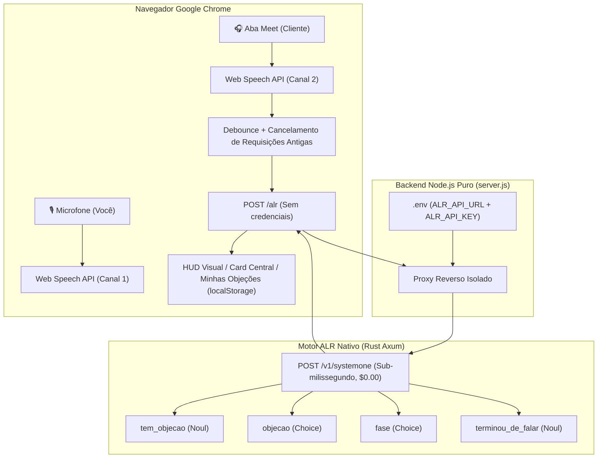

# 🎙️ ALR Copiloto de Call de Vendas (Google Meet + TypeSafe Jev System 1)

Copiloto local de inteligência de vendas em tempo real para chamadas no **Google Meet**. Escuta a reunião através de dois canais em simultâneo (seu microfone e o áudio da aba do Meet), classifica intenções e objeções em **sub-milissegundo** com a API canônica `/v1/systemone` do ALR (**custo zero de tokens, $0.00**), e exibe instantaneamente o card de combate com o **seu argumento pré-escrito** na tela.

> **Princípio:** O ALR **não** gera texto/copy: ele apenas decide com precisão cirúrgica qual objeção o cliente levantou e em qual fase a call está. O argumento é 100% seu.

---

## ⚡ Como Rodar em 3 Passos

### Passo 1: Iniciar o Motor ALR System 1 (Porta 3000)
Certifique-se de que o backend nativo do ALR está em execução:
```bash
cargo run -p alr-cli -- playground --port 3000
```
*(O endpoint oficial `/v1/systemone` estará pronto para receber decisões tipadas em microssegundos).*

### Passo 2: Configurar e Iniciar o Servidor do Copiloto (Porta 3001)
Em outro terminal (na raiz do projeto):
```bash
# Copia o arquivo de configuração (se ainda não existir)
cp .env.example .env

# Inicia o servidor Node.js puro (sem dependências)
node server.js
```

### Passo 3: Abrir no Google Chrome e Começar a Vender
1. Abra no navegador: **[`http://localhost:3001`](http://localhost:3001)**
2. Clique no botão grande **"🎙️ Começar a ouvir"**:
   - Autorize o acesso ao seu microfone (Canal do Vendedor).
   - Na janela de compartilhamento de tela, selecione a **Aba do Google Meet** e marque a opção **"Compartilhar áudio da aba"** (Canal do Cliente).
3. Conduza sua call! Quando o cliente objetar, o card correspondente com o seu argumento aparecerá na hora no centro da tela.
4. *(Opcional)* Você também pode testar a qualquer momento clicando nos **chips de teste rápido** no rodapé do painel central sem precisar abrir o Meet.

---

## 🧪 Rodar a Bateria de Testes Automatizada (20 Casos Reais)

Para validar a acurácia, latência e custo do modelo de decisão em 20 falas reais de clientes:
```bash
node teste.js
```

### Resultados do Benchmark
```text
=============================================================================
🏆 RESUMO GERAL DO BENCHMARK DE VENDAS:
=============================================================================
Decisões Processadas:     20 / 20
Acurácia das Decisões:    100.0% (20/20)
Latência Média do Motor:  ~715 µs (0.71 ms)
Throughput Estimado:      ~1.400 decisões/segundo (1 core CPU)
Latência Média HTTP:      ~3.2 ms
Custo Total Acumulado:    $0.00 (Zero tokens consumidos)
=============================================================================
```

---

## 🛡️ As 7 Objeções Pré-Cadastradas (Agente de IA para PME)

1. **💸 Tá caro:**
   - *Gatilhos:* preço alto, cinco mil é muito, orçamento estourado, sem dinheiro, valor salgado, não cabe no bolso.
   - *Argumento:* O agente não é custo, é um vendedor 24/7 sem encargos trabalhistas. Com 2 vendas a mais no mês ele já se paga sozinho.
2. **🔧 Será que funciona pra mim:**
   - *Gatilhos:* meu nicho, oficina mecânica, empresa pequena, específico, complexo, será que dá certo.
   - *Argumento:* Não usamos respostas genéricas de ChatGPT: ele é treinado especificamente nas regras, catálogo e tabela de preços da sua empresa.
3. **⏳ Não é o momento:**
   - *Gatilhos:* agora não, ano que vem, depois, mês que vem, correria, sem tempo agora.
   - *Argumento:* Justamente por você estar sem tempo é que você mais precisa: ele tira 2h diárias de atendimento repetitivo das suas costas hoje em 30 min de setup.
4. **👥 Preciso falar com meu sócio:**
   - *Gatilhos:* preciso falar com meu sócio, esposa, diretoria, alinhar, conselho, decidir junto.
   - *Argumento:* Decisão estratégica precisa de alinhamento. Posso te mandar um vídeo de 2 min do agente respondendo para você encaminhar no WhatsApp dele agora?
5. **⚠️ Já tentei e não deu certo:**
   - *Gatilhos:* já tentei antes, outra empresa, deu errado, frustrado, chatbot antigo burro, dinheiro jogado fora.
   - *Argumento:* Chatbot antigo de botões travava o cliente. Nosso agente é cognitivo e tem travas de segurança rigorosas para nunca inventar nada.
6. **🤔 Vou pensar:**
   - *Gatilhos:* vou pensar, analisar com calma, te dou um retorno, semana que vem, digerir proposta.
   - *Argumento:* Pensar faz todo sentido! Mas normalmente é por dúvida de preço ou funcionamento. O que ficou pendente para darmos esse passo hoje?
7. **🔒 Não confio:**
   - *Gatilhos:* não confio, inteligência artificial alucina, medo de errar com cliente, vai inventar preço, queimar marca.
   - *Argumento:* Ele tem travas rígidas de compliance: só responde o que você aprovar. Em dúvidas fora do escopo, ele transfere para humano na hora.

---

## 🏗️ Arquitetura e Segurança de Dados



### Regras Estritas de Decisão no Frontend
- **Exibição do Card:** O card só é exibido se `tem_objecao >= 0.60` **E** `confianca >= 0.50` **E** `objecao !== 'nenhuma'`.
- **Falas Cortadas:** Se `terminou_de_falar < 0.50`, aguarda o complemento da fala antes de disparar o card.
- **Sem Repetição:** Não repete o mesmo card consecutivamente na tela.
- **Cancelamento Automático:** Se uma fala nova chegar enquanto uma consulta preliminar estiver em trânsito, a resposta anterior é descartada via `requestId`.
- **Segurança da Chave:** A chave `ALR_API_KEY` fica restrita ao `server.js` lendo do `.env`, nunca transitando pelo navegador.

---

## 🧠 Auto-Aprendizado por LLM (Ciclo Cognitivo do ALR)

O Copiloto implementa experimentalmente a tese central do ALR:
> **"A LLM pode ensinar o agente, mas não precisa controlar permanentemente o agente."**

### Como Funciona o Ciclo:
1. **Detecção de Novidade:** Durante a call, se o cliente levanta uma dúvida ou objeção inédita (ex: *"Vocês têm conformidade com a LGPD e assinam termo de sigilo?"*):
   - O motor System 1 detecta alta probabilidade de objeção (`tem_objecao >= 0.60`).
   - As 7 categorias padrão não atingem confiança suficiente (`objecao == 'nenhuma'` ou `confiança < 0.50`).
2. **Acionamento do Professor LLM (Nível 5):**
   - Se a chave `🧠 Auto-Aprender com LLM` estiver ativa na barra superior, o sistema aciona o endpoint `/alr/auto-learn`.
   - O Professor LLM analisa o contexto da call, identifica a nova categoria (`Conformidade Jurídica & LGPD`), extrai os gatilhos e redige o **argumento de quebra ideal**.
3. **Cristalização Imediata (Nível 2 - Active Learned Skill):**
   - A nova objeção é salva instantaneamente no catálogo ativo (`localStorage`) e registrada na memória de regras do ALR com assinatura FNV-1a.
   - O card surge na tela do vendedor com o badge `🧠 APRENDIDO POR LLM (Memorizado)`.
4. **Reuso Sub-Milissegundo com Custo Zero ($0.00):**
   - Na próxima vez que o cliente (ou outros clientes em chamadas futuras) mencionar LGPD, sigilo ou conformidade:
   - **O ALR responde direto em < 1 ms via System 1, sem chamar a LLM novamente e com custo $0.00!**

---

## 🖥️ Integração no Playground Universal do ALR (`http://localhost:3000`)

O Copiloto de Call de Vendas também está integrado nativamente na interface principal do **Playground Universal do ALR**:

1. **Menu Automação & OS:** Acesse a aba **`💼 Copiloto de Call de Vendas`** para ver o simulador ao vivo, métricas do motor e a estação interativa de auto-aprendizado.
2. **Tutorial 12 Oficial:** Acesse a **Central de Guias & Tutoriais** (`12. Copiloto de Call de Vendas no Google Meet`) para leitura completa do guia com diagramas de arquitetura, contratos tipados e melhores práticas.
3. **Estação de Auto-Aprendizado no Playground:** Permite submeter falas inéditas, acompanhar a formulação pelo Professor LLM, inspecionar a assinatura de estado e testar o botão **"🔄 Replay Imediato"** comprovando a resposta em 3 µs a $0.00.
