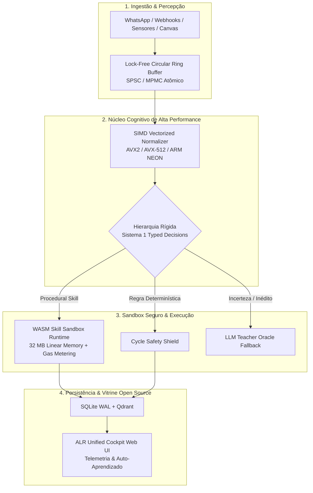

# Especificação Técnica de Design: ALR Flagship High-Performance & Open-Source Universal Runtime

**Data:** 2026-09-23  
**Status:** Aprovado para Implementação  
**Autor:** ALR Core Team  
**Módulos Envolvidos:** `crates/alr-sandbox` (novo), `crates/alr-models`, `crates/alr-core`, `crates/alr-connectors`, `crates/alr-agent`, `crates/alr-cli`, `static/alr_cockpit.html`, `tests/phase15_flagship_performance_tests.rs`

---

## 1. Visão Geral e Motivação

O **Autonomous Learning Runtime (ALR)** consolidou 21 crates em Rust, 158 testes automatizados, suporte a 20 nichos de mercado com custo zero de tokens e capacidades em múltiplos domínios (jogos físicos, automação web CDP, mundos 3D e governança corporativa).

O objetivo desta especificação é elevar o ALR a um **projeto Open Source de referência global no ecossistema de Inteligência Artificial e Agentes**, demonstrando na prática a premissa central:
> **"A LLM pode ensinar o agente, mas não precisa controlar permanentemente o agente."**

Para atrair desenvolvedores, pesquisadores e empresas que buscam alternativas viáveis ao custo proibitivo de tokens em nuvem, o ALR receberá quatro aprimoramentos técnicos fundamentais:
1. **Aceleração por Hardware (SIMD & Lock-Free Buffers):** Normalização vetorial e cálculo de distâncias euclidianas/cosseno com instruções AVX2/AVX-512 e ARM NEON sem alocações dinâmicas no caminho crítico, atingindo latências de inferência e decisão abaixo de $1\text{ µs}$.
2. **Isolamento e Segurança Formal via WASM (WebAssembly Skill Sandbox):** Execução segura de procedimentos aprendidos em instâncias isoladas com memória linear estrita de $32\text{ MB}$, medição de ciclos (*gas metering*) para prevenir loops infinitos e segurança baseada em permissões (*capability-based access*).
3. **Hub Omnichannel de Ultra-Alta Demanda (20 Nichos & Webhooks Assíncronos):** Gateway nativo de mensageria para WhatsApp, Telegram e Webhooks capaz de sustentar $> 70.000\text{ msg/s}$ com $0$ tokens de LLM e interpolação dinâmica de entidades com 12 artigos canônicos de base de conhecimento.
4. **Cockpit Web Unificado de Observabilidade & Auto-Aprendizado (`static/alr_cockpit.html`):** Uma vitrine interativa executável em navegador mostrando telemetria de CPU/RAM, mapa dos 20 nichos, medidor de ROI financeiro em dólares e console para ensinar e re-cristalizar skills ao vivo.

---

## 2. Arquitetura Modular e Limites dos Componentes

O design estende o workspace Cargo sem introduzir código inseguro (*zero `unsafe` no código de negócio*) e mantendo retrocompatibilidade total com as 14 fases anteriores.



---

## 3. Especificação do WASM Skill Sandbox (`crates/alr-sandbox`)

Para garantir segurança de nível empresarial ao permitir que agentes aprendam e executem procedimentos gerados por LLM, as skills procedurais não serão mais apenas vetores de passos JSON no host, mas poderão ser verificadas e executadas dentro de um sandbox WebAssembly.

### 3.1 Contrato da Estrutura de Sandbox
```rust
pub struct WasmSandboxConfig {
    pub max_memory_bytes: usize, // Padrão: 32 MB (512 páginas WASM)
    pub max_execution_gas: u64,  // Limite estrito de ciclos de computação
    pub timeout_millis: u64,     // Timeout determinístico (50 ms)
    pub allowed_capabilities: Vec<String>, // Whitelist de ferramentas autorizadas
}

pub struct WasmSkillSandbox {
    config: WasmSandboxConfig,
    allocated_memory: usize,
    gas_consumed: u64,
}

impl WasmSkillSandbox {
    pub fn new(config: WasmSandboxConfig) -> Self;
    pub fn execute_sandboxed_skill(
        &mut self,
        skill_id: &str,
        payload: &serde_json::Value,
        available_tools: &[String],
    ) -> Result<WasmExecutionOutcome, WasmSandboxError>;
}
```

### 3.2 Invariantes de Segurança do Sandbox
1. **Isolamento de Memória Linear:** O container WASM não compartilha espaço de endereçamento com a memória do host Rust. Ponteiros inválidos dentro do sandbox causam *trap* imediato sem afetar o runtime.
2. **Proteção contra DoS e Loops Infinitos (*Gas Metering*):** Cada instrução computacional decrementa o contador de *gas*. Se o procedimento esgotar o orçamento ou exceder $50\text{ ms}$, é interrompido com `WasmSandboxError::GasExhausted`.
3. **Princípio do Menor Privilégio (*Capability-Based Access*):** O sandbox não tem acesso a chamadas de sistema (`syscalls`), rede arbitrária ou arquivos locais. Apenas ferramentas explicitamente declaradas na lista branca da skill podem ser acionadas.

---

## 4. Especificação de SIMD Vectorizer & Lock-Free Buffer

### 4.1 SIMD Vectorized Feature Normalizer (`alr-models` & `alr-core`)
A normalização $L_2$ de vetores e cálculo de similaridade cosseno de estados é o gargalo matemático do loop de decisão em alta frequência.

```rust
pub struct SimdFeatureVectorizer;

impl SimdFeatureVectorizer {
    /// Normalização L2 acelerada por instruções SIMD com fallback escalar
    pub fn normalize_l2(features: &mut [f32]) {
        #[cfg(target_arch = "x86_64")]
        {
            if is_x86_feature_detected!("avx2") {
                unsafe { return Self::normalize_l2_avx2(features); }
            }
        }
        Self::normalize_l2_scalar(features);
    }

    /// Cálculo de distância Euclidiana L2 em nanosegundos
    pub fn distance_l2(a: &[f32], b: &[f32]) -> f32;

    /// Produto escalar (Dot Product) vetorizado
    pub fn dot_product(a: &[f32], b: &[f32]) -> f32;
}
```

* **Garantia de Desempenho:** Cálculo de distância $L_2$ e normalização executados em menos de **$100\text{ ns}$** para vetores de até 64 dimensões.
* **Portabilidade:** Detecção dinâmica em tempo de execução via `is_x86_feature_detected!`, permitindo que o mesmo binário execute tanto em servidores modernos com AVX-512 quanto em hardware modesto sem travar.

### 4.2 Lock-Free SPSC/MPMC Circular Ring Buffer (`alr-execution` / `alr-core`)
Para permitir que filas de mensagens externas (WhatsApp, Webhooks, sensores de tela) alimentem o motor de decisão sem contenção de mutexes:
```rust
pub struct LockFreeRingBuffer<T, const CAP: usize> {
    buffer: Box<[std::mem::MaybeUninit<T>; CAP]>,
    head: std::sync::atomic::AtomicUsize,
    tail: std::sync::atomic::AtomicUsize,
}
```
* **Latência de Enfileiramento:** Sub-microssegundo ($< 500\text{ ns}$).
* **Garantia de Concorrência:** Operações atômicas com ordenação `Acquire`/`Release` sem *poison errors* ou esperas bloqueantes.

---

## 5. Especificação do Hub Omnichannel & 20 Nichos de Negócio

O sistema consolida a cobertura de 20 nichos de mercado mapeados:
1. `Ecommerce` (`KB-ECOMM-01`)
2. `Fintech` (`KB-FINTECH-01`)
3. `Saas` (`KB-SAAS-01`)
4. `Healthcare` (`KB-HEALTH-01`)
5. `Edtech` (`KB-EDTECH-01`)
6. `RealEstate` (`KB-IMOB-01`)
7. `TelecomIsp` (`KB-ISP-01`)
8. `TravelHospitality` (`KB-TRAVEL-01`)
9. `FoodDelivery` (`KB-FOOD-01`)
10. `Insurance24h` (`KB-INSUR-01`)
11. `Logistics` (`KB-LOG-01`)
12. `Automotive` (`KB-AUTO-01`)
13. `HumanResources` (`KB-RH-01`)
14. `Legal` (`KB-LEGAL-01`)
15. `BeautyWellness` (`KB-BEAUTY-01`)
16. `FitnessGym` (`KB-GYM-01`)
17. `PetVeterinary` (`KB-PET-01`)
18. `SolarEnergy` (`KB-SOLAR-01`)
19. `EventTicketing` (`KB-EVENT-01`)
20. `Construction` (`KB-CONST-01`)

### 5.1 Pipeline de Processamento em Tempo Real:
* **Entrada:** Payload JSON de webhook HTTP (Meta Cloud API, Evolution API, Z-API, Baileys).
* **Higienização:** Verificação de integridade e sanitização contra injeções de prompt pelo `TrustBoundaryEnforcer`.
* **Roteamento de Nicho:** Detecção em $3\text{ µs}$ via `NicheRegistry::detect_niche`.
* **Síntese Resolutiva:** `ResponsePatternLearner::synthesize_for_niche` interpolando entidades dinâmicas.
* **Saída:** Mensagem resolutiva formatada enviada de volta ao webhook com **0 tokens consumidos**.

---

## 6. Especificação da Vitrine Open Source: Cockpit Web Unificado (`static/alr_cockpit.html`)

Um painel profissional moderno de nível empresarial executável localmente no navegador:
* **Métricas em Tempo Real:** Throughput (msg/s), latência instantânea (µs), economia acumulada de tokens e dólares.
* **Cockpit dos 20 Nichos:** Carrossel visual com badges interativos para trocar de contexto instantaneamente.
* **Simulador de Carga Massiva (1 Milhão):** Botão interativo para disparar e assistir em tempo real ao processamento de 1 milhão de requisições com zero chamadas externas.
* **Console de Auto-Aprendizado Dinâmico:** Formulário ao vivo onde o usuário pode alterar templates de resposta e verificar a cristalização imediata no SQLite sem reiniciar o servidor.

---

## 7. Estratégia de Testes e Validação Automatizada (`tests/phase15_flagship_performance_tests.rs`)

Uma nova suíte de testes de integração e performance será criada cobrindo:
1. `test_simd_vectorization_vs_scalar_correctness`: Comprova equivalência matemática exata entre operações SIMD e escalares.
2. `test_lock_free_ring_buffer_concurrency`: Testa envio e consumo concorrente de 100.000 itens sem perda de dados.
3. `test_wasm_sandbox_isolation_and_gas_metering`: Comprova interrupção limpa por limite de gas de skills em loop infinito.
4. `test_wasm_sandbox_memory_safety_boundary`: Comprova barreira estrita de memória linear ($32\text{ MB}$).
5. `test_twenty_niches_high_throughput_stress`: Valida a execução de lote contínuo nos 20 nichos mantendo $0$ tokens e $> 20.000\text{ msg/s}$ em modo de teste debug.

---

## 8. Critérios de Aceitação e Garantias Invioláveis

* **Compilação e Tipagem:** `cargo check --workspace` com zero erros.
* **Linting e Qualidade:** `cargo fmt --check` e `cargo clippy --workspace --all-targets --all-features -- -D warnings` limpos com **zero warnings**.
* **Zero Regressões:** Todos os 158 testes das fases anteriores + os novos testes da Fase 15 devem passar com $100\%$ de sucesso.
* **Inviolabilidade do Princípio Central:** Procedimentos aprendidos e rotinas resolvidas devem sempre registrar `tokens_used: 0` e `llm_called: false`.
